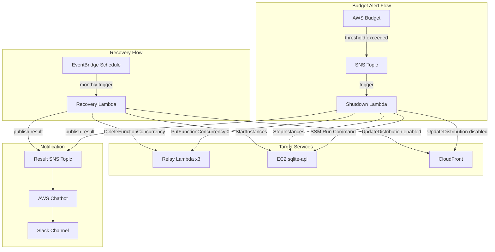
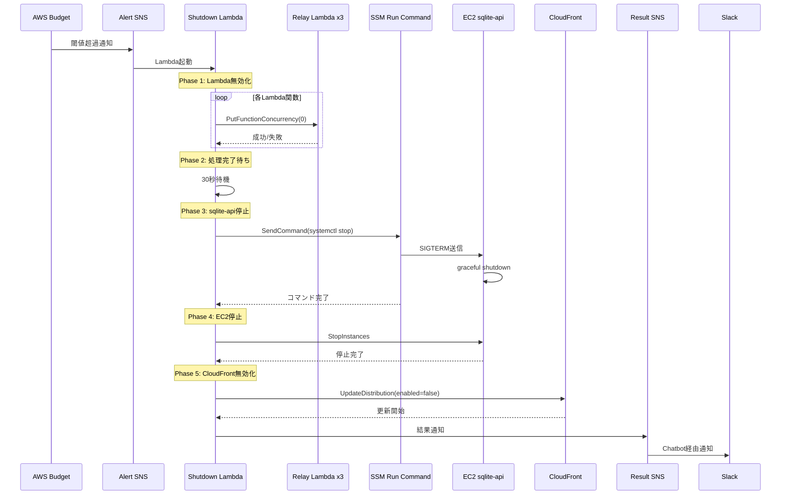
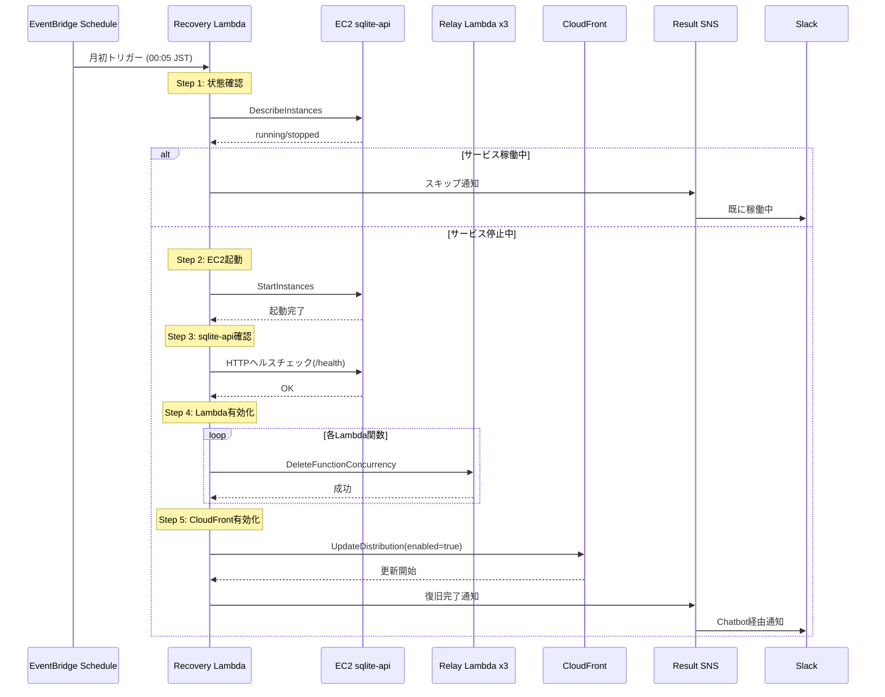

# Technical Design Document

## Overview

**Purpose**: 本機能はAWS予算アラートに基づくサービス自動停止・復旧機能を提供する。月間AWSコストが設定した閾値を超過した場合、relay（Lambda）およびsqlite-api（EC2）サービスを自動的に停止し、予期しないコスト増加を防止する。

**Users**: システム運用者がコスト管理のために利用する。Nostrクライアントユーザーにはサービス停止として影響する。

**Impact**: 既存のrelay Lambda関数（connect/disconnect/default）のconcurrency制御、sqlite-api EC2インスタンスの起動/停止、CloudFrontディストリビューションの有効化/無効化を行う。

### Goals

- AWS Budgetの閾値超過時に自動でサービスを停止し、予期しないコスト増加を防止する
- 月初に自動でサービスを復旧し、手動介入なしで運用を再開する
- Slack通知により停止/復旧状態を運用者に即時通知する

### Non-Goals

- AWS Budget閾値の動的変更機能（Terraform変数で固定）
- 部分的なサービス停止（全サービス一括停止/復旧のみ）
- 停止中のリクエストキューイング（即座に拒否）
- 複数環境（staging/production）対応（単一環境のみ）

## Architecture

### Existing Architecture Analysis

現行アーキテクチャ（tech.mdより）:
- **relay Lambda関数**: connect/disconnect/default（API Gateway v2 WebSocket経由）
- **sqlite-api**: EC2 t4g.nano上でaxum HTTPサーバーとして稼働、systemdで管理
- **CloudFront**: Lambda@Edgeでプロトコルルーティング
- **Terraform**: modules/api, modules/ec2-searchでリソース管理

本設計で新規追加するコンポーネント:
- **modules/budget**: 予算管理用Terraformモジュール
- **Shutdown Lambda**: サービス停止処理
- **Recovery Lambda**: サービス復旧処理
- **sqlite-api graceful shutdown**: SIGTERMハンドリング追加

### Architecture Pattern & Boundary Map



**Architecture Integration**:
- Selected pattern: イベント駆動アーキテクチャ（AWS Budget -> SNS -> Lambda）
- Domain/feature boundaries: 予算管理は独立したモジュール（modules/budget）として分離
- Existing patterns preserved: Lambda関数はservices/relay/src/bin/に追加（既存パターン踏襲）
- New components rationale: Shutdown/Recovery Lambdaは運用ツール系として既存構造に適合
- Steering compliance: ARM64アーキテクチャ、Rust実装、Terraformモジュールパターンを維持

### Technology Stack

| Layer | Choice / Version | Role in Feature | Notes |
|-------|------------------|-----------------|-------|
| Backend / Services | Rust (Edition 2024) + lambda_runtime | Shutdown/Recovery Lambda実装 | 既存relay serviceに追加 |
| Backend / Services | axum 0.8 + tokio signal | sqlite-api graceful shutdown | SIGTERMハンドリング追加 |
| Infrastructure / Runtime | AWS Lambda (ARM64, provided.al2023) | Shutdown/Recovery関数実行 | 既存パターン踏襲 |
| Messaging / Events | AWS SNS | Budget通知、結果通知 | AWS Chatbot連携 |
| Messaging / Events | EventBridge Scheduler | 月次Recovery トリガー | cron式でスケジュール |
| Infrastructure / Runtime | Terraform (~> 5.0) | modules/budget新規作成 | 既存モジュールパターン踏襲 |

## System Flows

### サービス停止フロー



**Key Decisions**:
- Phase 1でLambda無効化を先に実行し、新規リクエストを即座にブロック
- Phase 2の30秒待機で実行中のLambda関数が完了する時間を確保
- Phase 3でsqlite-apiのgraceful shutdownによりデータ整合性を維持
- 各Phaseの失敗は継続し、最終結果をまとめて通知（エラー継続戦略）

### サービス復旧フロー



**Key Decisions**:
- Step 1で状態確認を行い、既に稼働中であればスキップ
- Step 3でsqlite-apiの既存`/health`エンドポイントを利用してヘルスチェック
- **エラー発生時は即座に処理を中断し、その時点の状態を通知**（Shutdown Lambdaのエラー継続戦略とは異なる）
- 手動介入が必要な場合は通知内容から状況を把握可能

## Requirements Traceability

| Requirement | Summary | Components | Interfaces | Flows |
|-------------|---------|------------|------------|-------|
| 1.1, 1.2, 1.3, 1.4 | 予算閾値設定 | BudgetResource, AlertSNSTopic | AWS Budget API | - |
| 2.1, 2.2, 2.3, 2.4, 2.5 | 通知インフラ | AlertSNSTopic, ResultSNSTopic, ChatbotConfig | SNS Publish, Chatbot | - |
| 3.1, 3.2 | Lambda無効化 | ShutdownLambda | Lambda PutFunctionConcurrency | 停止フロー Phase 1 |
| 3.3 | 処理完了待ち | ShutdownLambda | - | 停止フロー Phase 2 |
| 3.4, 3.5 | sqlite-api停止 | ShutdownLambda, SqliteApiGraceful | SSM SendCommand | 停止フロー Phase 3 |
| 3.6 | EC2停止 | ShutdownLambda | EC2 StopInstances | 停止フロー Phase 4 |
| 3.7 | CloudFront無効化 | ShutdownLambda | CloudFront UpdateDistribution | 停止フロー Phase 5 |
| 3.8, 3.9, 3.10 | 結果通知 | ShutdownLambda | SNS Publish | 停止フロー |
| 4.1, 4.2 | 自動復旧トリガー | EventBridgeRule | EventBridge Schedule | - |
| 4.3 | Recovery Lambda | RecoveryLambda | - | 復旧フロー |
| 4.4, 4.5 | EC2起動・確認 | RecoveryLambda | EC2 StartInstances, HTTP | 復旧フロー Step 2-3 |
| 4.6 | Lambda有効化 | RecoveryLambda | Lambda DeleteFunctionConcurrency | 復旧フロー Step 4 |
| 4.7 | CloudFront有効化 | RecoveryLambda | CloudFront UpdateDistribution | 復旧フロー Step 5 |
| 4.8, 4.9 | 復旧結果通知 | RecoveryLambda | SNS Publish | 復旧フロー |
| 4.10 | 手動復旧手順 | Documentation | - | - |
| 5.1 | モジュール管理 | BudgetModule | Terraform | - |
| 5.2, 5.3 | IAMポリシー | ShutdownLambdaRole, RecoveryLambdaRole | IAM | - |
| 5.4 | ARM64デプロイ | ShutdownLambda, RecoveryLambda | Lambda | - |
| 5.5 | EventBridge権限 | EventBridgeRule | Lambda Permission | - |
| 5.6 | 設定変数 | BudgetModule | Terraform Variables | - |

## Components and Interfaces

### Summary

| Component | Domain/Layer | Intent | Req Coverage | Key Dependencies (P0/P1) | Contracts |
|-----------|--------------|--------|--------------|--------------------------|-----------|
| BudgetModule | Infrastructure | 予算管理Terraformモジュール | 1.1-1.4, 2.1-2.5, 5.1-5.6 | AWS Provider (P0) | - |
| ShutdownLambda | Application | サービス自動停止処理 | 3.1-3.10 | Lambda SDK (P0), EC2 SDK (P0), SSM SDK (P0), CloudFront SDK (P1) | Service |
| RecoveryLambda | Application | サービス自動復旧処理 | 4.3-4.9 | Lambda SDK (P0), EC2 SDK (P0), CloudFront SDK (P1), reqwest (P1) | Service |
| SqliteApiGraceful | Application | sqlite-api graceful shutdown | 3.5 | tokio signal (P0) | - |

### Infrastructure Layer

#### BudgetModule (terraform/modules/budget)

| Field | Detail |
|-------|--------|
| Intent | AWS Budget、SNS、Chatbot、EventBridgeリソースを管理するTerraformモジュール |
| Requirements | 1.1, 1.2, 1.3, 1.4, 2.1, 2.2, 2.3, 2.4, 5.1, 5.2, 5.3, 5.4, 5.5, 5.6 |

**Responsibilities & Constraints**
- AWS Budgetリソースの作成と閾値設定
- 予算アラート用SNSトピックとポリシーの管理
- AWS Chatbot Slack連携の設定
- Shutdown/Recovery Lambda関数のIAMロール・ポリシー定義
- EventBridge Scheduleルールの作成
- 変数による設定のパラメータ化

**Dependencies**
- External: AWS Provider ~> 5.0 — Terraform AWS リソース管理 (P0)
- External: Random Provider ~> 3.0 — ランダム文字列生成（必要に応じて） (P2)
- Outbound: modules/api — relay Lambda関数名の参照 (P0)
- Outbound: modules/ec2-search — EC2インスタンスID、CloudFront ID参照 (P0)

**Contracts**: Infrastructure Definition (Terraform)

##### Terraform Variables

```hcl
variable "budget_limit_amount" {
  description = "月額予算閾値（USD）"
  type        = string
  default     = "10"
}

variable "slack_workspace_id" {
  description = "Slackワークスペース ID（例: T07EA123LEP）"
  type        = string
}

variable "slack_channel_id" {
  description = "Slackチャンネル ID（例: C07EZ1ABC23）"
  type        = string
}

variable "recovery_schedule_time" {
  description = "月次復旧実行時刻（cron式）"
  type        = string
  default     = "cron(5 15 1 * ? *)"  # 毎月1日 00:05 JST
}

variable "relay_lambda_function_names" {
  description = "停止対象のrelay Lambda関数名リスト"
  type        = list(string)
}

variable "ec2_instance_id" {
  description = "sqlite-api EC2インスタンスID"
  type        = string
}

variable "cloudfront_distribution_id" {
  description = "CloudFrontディストリビューションID"
  type        = string
}
```

##### Terraform Outputs

```hcl
output "alert_sns_topic_arn" {
  description = "予算アラートSNSトピックARN"
}

output "result_sns_topic_arn" {
  description = "結果通知SNSトピックARN"
}

output "shutdown_lambda_function_name" {
  description = "Shutdown Lambda関数名"
}

output "recovery_lambda_function_name" {
  description = "Recovery Lambda関数名"
}
```

**Implementation Notes**
- Integration: modules/apiとmodules/ec2-searchからリソースIDを変数として受け取る
- Validation: Slackワークスペース連携は事前にAWS Console手動設定が必要
- Risks: Chatbot設定はSlackワークスペース連携後にのみ適用可能

---

### Application Layer

#### ShutdownLambda (services/relay/src/bin/shutdown.rs)

| Field | Detail |
|-------|--------|
| Intent | 予算超過時にサービスを段階的に停止する |
| Requirements | 3.1, 3.2, 3.3, 3.4, 3.5, 3.6, 3.7, 3.8, 3.9, 3.10 |

**Responsibilities & Constraints**
- SNSイベントからのトリガー受信
- Phase 1: relay Lambda関数のreserved concurrencyを0に設定
- Phase 2: 実行中Lambda完了を待機（30秒）
- Phase 3: SSM Run Command経由でsqlite-api停止
- Phase 4: EC2インスタンス停止
- Phase 5: CloudFrontディストリビューション無効化
- 各Phaseの結果をログ記録、最終結果をSNS通知
- いずれかのPhaseが失敗しても処理継続

**Dependencies**
- Inbound: SNS Topic — 予算アラートトリガー (P0)
- External: aws-sdk-lambda — PutFunctionConcurrency, DeleteFunctionConcurrency (P0)
- External: aws-sdk-ec2 — StopInstances, DescribeInstances (P0)
- External: aws-sdk-ssm — SendCommand, GetCommandInvocation (P0)
- External: aws-sdk-cloudfront — UpdateDistribution, GetDistribution (P1)
- External: aws-sdk-sns — Publish (P0)

**Contracts**: Service [x] / API [ ] / Event [x] / Batch [ ] / State [ ]

##### Service Interface

```rust
/// Shutdown Lambda メインハンドラー
/// SNSイベントから起動され、サービス停止処理を実行する
async fn handler(event: LambdaEvent<SnsEvent>) -> Result<(), Error> {
    // 5つのPhaseを順次実行
    // 各Phaseの結果をShutdownResultに記録
    // 最終結果をSNS通知
}

/// 各Phaseの実行結果
struct PhaseResult {
    phase: String,
    success: bool,
    message: String,
    duration_ms: u64,
}

/// 全体の実行結果
struct ShutdownResult {
    phases: Vec<PhaseResult>,
    overall_success: bool,
    total_duration_ms: u64,
}
```

- Preconditions: 有効なSNSイベント、IAM権限
- Postconditions: サービス停止状態、結果通知完了
- Invariants: 各Phaseは独立して失敗可能

##### Event Contract

- Published events: `shutdown-result` (SNS Topic)
  ```json
  {
    "type": "shutdown-result",
    "timestamp": "2025-01-15T10:30:00Z",
    "overall_success": true,
    "phases": [
      {"phase": "lambda-disable", "success": true, "message": "3 functions disabled"},
      {"phase": "wait-completion", "success": true, "message": "waited 30s"},
      {"phase": "sqlite-api-stop", "success": true, "message": "graceful shutdown completed"},
      {"phase": "ec2-stop", "success": true, "message": "instance stopped"},
      {"phase": "cloudfront-disable", "success": true, "message": "distribution disabled"}
    ]
  }
  ```
- Subscribed events: `budget-alert` (SNS Topic from AWS Budget)
- Ordering / delivery guarantees: At-least-once (SNS standard)

**Implementation Notes**
- Integration: 環境変数からLambda関数名、EC2インスタンスID、CloudFront IDを取得
- Validation: 各APIコールの戻り値を検証、エラーはログ記録して継続
- Risks: SSM Run Commandのタイムアウト（デフォルト60秒）を考慮

---

#### RecoveryLambda (services/relay/src/bin/recovery.rs)

| Field | Detail |
|-------|--------|
| Intent | 月初または手動トリガーでサービスを復旧する |
| Requirements | 4.3, 4.4, 4.5, 4.6, 4.7, 4.8, 4.9 |

**Responsibilities & Constraints**
- EventBridgeスケジュールまたは手動invocationからのトリガー受信
- Step 1: EC2インスタンス状態確認（稼働中ならスキップ）
- Step 2: EC2インスタンス起動
- Step 3: sqlite-apiヘルスチェック（既存の`/health`エンドポイントを利用）
- Step 4: relay Lambda関数のreserved concurrency設定削除
- Step 5: CloudFrontディストリビューション有効化
- 復旧結果をSNS通知
- **エラー発生時は即座に処理を中断し、その時点の状態を通知**（Shutdownと異なりエラー継続しない）

**Dependencies**
- Inbound: EventBridge Schedule — 月次トリガー (P0)
- External: aws-sdk-lambda — DeleteFunctionConcurrency, GetFunction (P0)
- External: aws-sdk-ec2 — StartInstances, DescribeInstances (P0)
- External: aws-sdk-cloudfront — UpdateDistribution, GetDistribution (P1)
- External: aws-sdk-sns — Publish (P0)
- External: reqwest — HTTPヘルスチェック (P1)

**Contracts**: Service [x] / API [ ] / Event [x] / Batch [ ] / State [ ]

##### Service Interface

```rust
/// Recovery Lambda メインハンドラー
/// EventBridgeまたは手動invocationから起動され、サービス復旧処理を実行する
async fn handler(event: LambdaEvent<Value>) -> Result<(), Error> {
    // Step 1: 状態確認
    // Step 2-5: 復旧処理
    // 結果をSNS通知
}

/// 復旧処理の実行結果
struct RecoveryResult {
    skipped: bool,
    skip_reason: Option<String>,
    steps: Vec<StepResult>,
    overall_success: bool,
    total_duration_ms: u64,
}

struct StepResult {
    step: String,
    success: bool,
    message: String,
    duration_ms: u64,
}
```

- Preconditions: IAM権限、EC2インスタンス存在
- Postconditions: サービス稼働状態、結果通知完了
- Invariants: 既に稼働中の場合はスキップ、エラー発生時は即座に中断して通知

##### Event Contract

- Published events: `recovery-result` (SNS Topic)
  ```json
  // 成功時
  {
    "type": "recovery-result",
    "timestamp": "2025-02-01T00:05:30Z",
    "skipped": false,
    "overall_success": true,
    "steps": [
      {"step": "ec2-start", "success": true, "message": "instance started"},
      {"step": "health-check", "success": true, "message": "sqlite-api healthy"},
      {"step": "lambda-enable", "success": true, "message": "3 functions enabled"},
      {"step": "cloudfront-enable", "success": true, "message": "distribution enabled"}
    ]
  }
  // エラー発生時（途中で中断）
  {
    "type": "recovery-result",
    "timestamp": "2025-02-01T00:05:45Z",
    "skipped": false,
    "overall_success": false,
    "error_step": "health-check",
    "error_message": "sqlite-api health check failed after 5 retries",
    "completed_steps": [
      {"step": "ec2-start", "success": true, "message": "instance started"}
    ]
  }
  ```
- Subscribed events: EventBridge Schedule (cron)
- Ordering / delivery guarantees: At-most-once (schedule trigger)

**Implementation Notes**
- Integration: 環境変数からsqlite-apiエンドポイントURL、Lambda関数名等を取得
- Validation: ヘルスチェックはリトライロジック付き（最大5回、5秒間隔）
- Risks: EC2起動完了までの待機時間（最大2分）を考慮

---

#### SqliteApiGraceful (services/sqlite-api)

| Field | Detail |
|-------|--------|
| Intent | SIGTERMシグナルを受信してgraceful shutdownを実行する |
| Requirements | 3.5 |

**Responsibilities & Constraints**
- SIGTERMシグナルの受信
- 新規リクエストの受付停止
- 処理中リクエストの完了待機
- SQLiteコネクションのクローズ
- プロセス正常終了

**Note**: `/health`エンドポイントはsqlite-apiに既存（`services/sqlite-api/src/main.rs:53`）。Recovery Lambdaのヘルスチェックはこの既存エンドポイントを利用するため、本コンポーネントでの追加実装は不要。

**Dependencies**
- External: tokio signal — SIGTERMハンドリング (P0)
- External: axum 0.8 — with_graceful_shutdown API (P0)

**Contracts**: Service [x] / API [ ] / Event [ ] / Batch [ ] / State [ ]

##### Service Interface

```rust
/// シャットダウンシグナル待機
async fn shutdown_signal() {
    // SIGTERM または Ctrl+C を待機
    let ctrl_c = async {
        signal::ctrl_c().await.expect("Failed to install CTRL+C handler");
    };

    let terminate = async {
        signal::unix::signal(signal::unix::SignalKind::terminate())
            .expect("Failed to install SIGTERM handler")
            .recv()
            .await;
    };

    tokio::select! {
        _ = ctrl_c => tracing::info!("Ctrl+C received"),
        _ = terminate => tracing::info!("SIGTERM received"),
    }
}

// main関数での使用
axum::serve(listener, app)
    .with_graceful_shutdown(shutdown_signal())
    .await
```

- Preconditions: tokio runtime起動済み
- Postconditions: 全リクエスト処理完了、コネクションクローズ
- Invariants: シグナル受信後は新規リクエストを拒否

**Implementation Notes**
- Integration: 既存main関数の`axum::serve`呼び出しを修正
- Validation: シグナルハンドラー登録の成功確認
- Risks: 処理中リクエストが長時間かかる場合のタイムアウト考慮（systemd TimeoutStopSec）

## Data Models

### Domain Model

本機能は永続化データを持たず、AWSリソースの状態を制御する。

**状態遷移**:
- サービス状態: `running` -> `shutting_down` -> `stopped` -> `starting` -> `running`
- Lambda concurrency: `default` -> `0` -> `default`
- EC2状態: `running` -> `stopping` -> `stopped` -> `pending` -> `running`
- CloudFront状態: `Deployed (Enabled)` -> `InProgress` -> `Deployed (Disabled)`

### Data Contracts & Integration

#### Lambda環境変数

```
# Shutdown Lambda
RELAY_LAMBDA_FUNCTION_NAMES=nostr_relay_connect,nostr_relay_disconnect,nostr_relay_default
EC2_INSTANCE_ID=i-0123456789abcdef0
CLOUDFRONT_DISTRIBUTION_ID=E1234567890ABC
RESULT_SNS_TOPIC_ARN=arn:aws:sns:ap-northeast-1:123456789012:budget-result
SQLITE_API_SYSTEMD_SERVICE=nostr-api

# Recovery Lambda
RELAY_LAMBDA_FUNCTION_NAMES=nostr_relay_connect,nostr_relay_disconnect,nostr_relay_default
EC2_INSTANCE_ID=i-0123456789abcdef0
CLOUDFRONT_DISTRIBUTION_ID=E1234567890ABC
RESULT_SNS_TOPIC_ARN=arn:aws:sns:ap-northeast-1:123456789012:budget-result
SQLITE_API_ENDPOINT=https://abc123.relay.nostr.nisshiee.org
```

## Error Handling

### Error Strategy

**Shutdown Lambda（エラー継続戦略）**:
各Phaseは独立して実行され、失敗しても次のPhaseに進む。全Phaseの結果をまとめてSNS通知する。これにより、一部コンポーネントの停止に失敗しても、可能な限り多くのサービスを停止してコストを抑制する。

**Recovery Lambda（エラー中断戦略）**:
いずれかのStepでエラーが発生した場合、即座に処理を中断してその時点の状態を通知する。部分的に復旧した状態でLambdaやCloudFrontを有効化すると、ユーザーにエラーが露出するため、手動介入を促す戦略を採用する。

### Error Categories and Responses

**Shutdown Lambda（AWS API Errors）**:
- Lambda PutFunctionConcurrency失敗: ログ記録、次Phase継続、結果にfailure記録
- EC2 StopInstances失敗: ログ記録、次Phase継続、結果にfailure記録
- SSM SendCommand失敗: ログ記録、次Phase継続、結果にfailure記録
- CloudFront UpdateDistribution失敗: ログ記録、結果にfailure記録
- SSM Run Commandタイムアウト: 60秒後にタイムアウト扱い、次Phase継続

**Recovery Lambda（AWS API Errors）**:
- EC2 StartInstances失敗: 処理中断、エラー通知
- sqlite-apiヘルスチェック失敗: リトライ（5回、5秒間隔）、最終的に失敗なら処理中断、エラー通知
- Lambda DeleteFunctionConcurrency失敗: 処理中断、エラー通知
- CloudFront UpdateDistribution失敗: 処理中断、エラー通知
- EC2起動待機タイムアウト: 2分後にタイムアウト扱い、処理中断、エラー通知

### Monitoring

- CloudWatch Logs: 全Phase結果を構造化ログ（JSON）で記録
- SNS通知: overall_success=falseの場合はSlackに警告レベルで通知
- CloudWatch Metrics: Lambda関数の標準メトリクス（Duration, Errors, Invocations）

## Testing Strategy

### Unit Tests

- **ShutdownLambda Phase実行ロジック**: 各Phaseの成功/失敗パターン
- **RecoveryLambda Step実行ロジック**: 各Stepの成功/失敗パターン、スキップ判定
- **SqliteApiGraceful shutdown_signal**: シグナルハンドラー登録確認
- **環境変数パース**: 複数Lambda関数名のパース

### Integration Tests

- **ShutdownLambda AWS SDK呼び出し**: モックを使用したAWS API呼び出しテスト
- **RecoveryLambda AWS SDK呼び出し**: モックを使用したAWS API呼び出しテスト
- **SSM Run Command統合**: LocalStackを使用したSSMコマンド実行テスト
- **SNS通知統合**: LocalStackを使用したSNS Publish確認

### E2E Tests (手動)

- **停止フロー全体テスト**: 実環境でBudgetアラートをシミュレート、全サービス停止確認
- **復旧フロー全体テスト**: Recovery Lambda手動実行、全サービス復旧確認
- **Slack通知確認**: 停止/復旧結果がSlackに届くことを確認

## Optional Sections

### Security Considerations

**IAM最小権限ポリシー**:
- Shutdown Lambda: lambda:PutFunctionConcurrency, lambda:GetFunction, ec2:StopInstances, ec2:DescribeInstances, ssm:SendCommand, ssm:GetCommandInvocation, cloudfront:UpdateDistribution, cloudfront:GetDistribution, sns:Publish, logs:*
- Recovery Lambda: lambda:DeleteFunctionConcurrency, lambda:GetFunction, ec2:StartInstances, ec2:DescribeInstances, cloudfront:UpdateDistribution, cloudfront:GetDistribution, sns:Publish, logs:*
- 対象リソースはARNで限定（特定のLambda関数、EC2インスタンス、CloudFront Distribution）

**認証**:
- SNS -> Lambda: IAMリソースベースポリシー
- EventBridge -> Lambda: IAMリソースベースポリシー
- AWS Chatbot -> Slack: OAuth認証（初回手動設定）

### Performance & Scalability

**実行時間目標**:
- Shutdown Lambda: 最大3分（SSM待機含む）
- Recovery Lambda: 最大3分（EC2起動待機含む）
- sqlite-api graceful shutdown: 最大30秒

**Lambda設定**:
- Timeout: 180秒（3分）
- Memory: 256MB（AWS SDK使用に十分）
- Architecture: ARM64（コスト最適化）

### Migration Strategy

**デプロイ順序**:
1. sqlite-api graceful shutdown実装をデプロイ（EC2バイナリ更新）
2. Shutdown/Recovery Lambda関数をビルド・デプロイ
3. modules/budget Terraformモジュールを適用
4. AWS Console手動でSlackワークスペース連携を設定
5. Terraform再適用でChatbot設定を完了
6. 動作確認テスト実行

**ロールバック**:
- Lambda関数: 前バージョンにrevert、concurrency設定を手動削除
- Terraform: `terraform destroy -target=module.budget`で予算リソースのみ削除
- sqlite-api: 前バージョンのバイナリに戻す（graceful shutdownなしでも動作）
