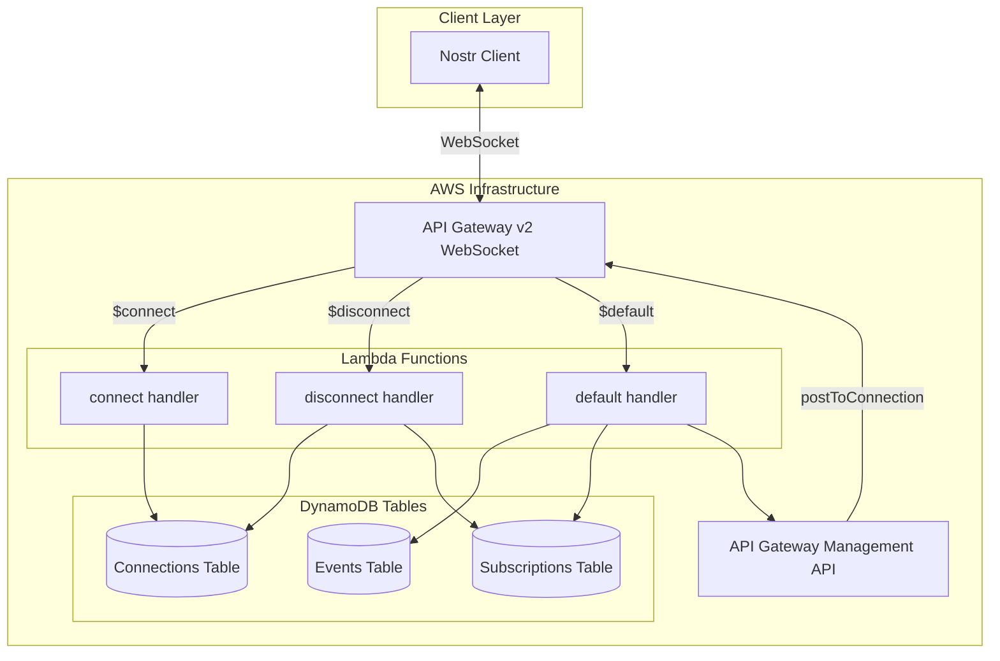
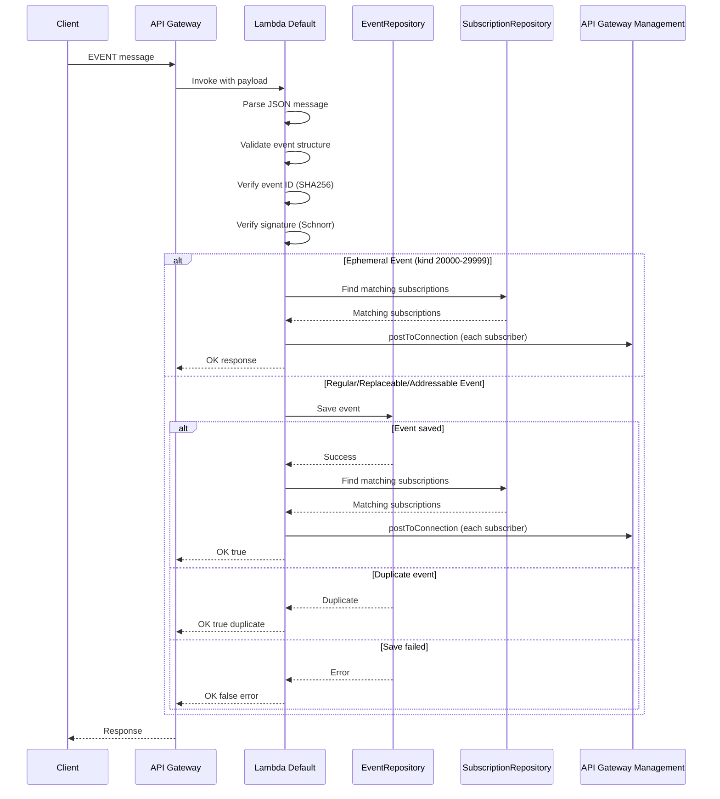
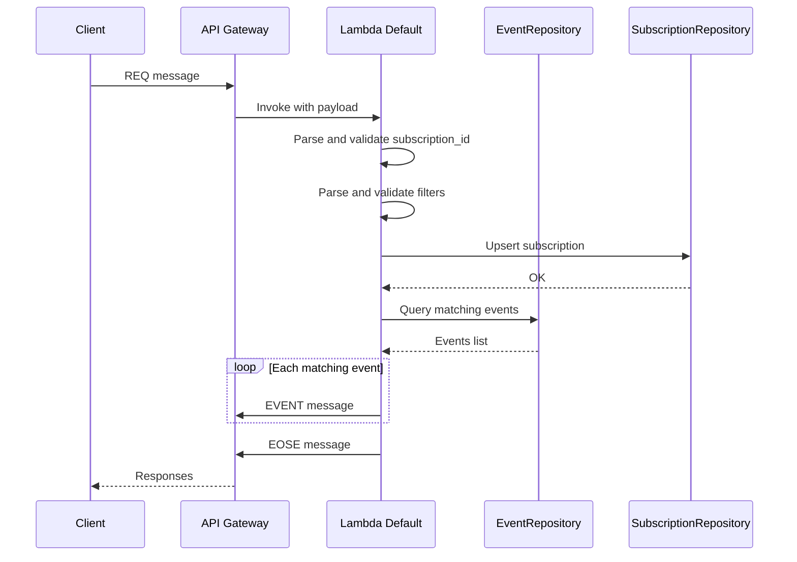
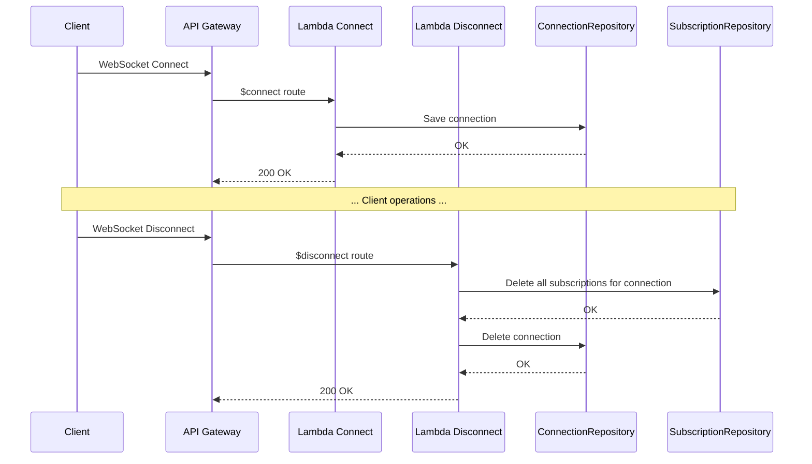

# Technical Design Document: NIP-01 Implementation

## Overview

**Purpose**: 本機能は、Nostrプロトコルの基本仕様であるNIP-01を完全実装し、Nostrクライアントがイベントの発行・購読・取得を行えるようにする。

**Users**: Nostrクライアントアプリケーション（Damus、Amethyst、Snort等）のユーザーが、WebSocket経由でイベントを送受信する。

**Impact**: 現在のスケルトン実装を、NIP-01準拠のフル機能Relayに拡張する。Lambda関数の処理ロジック追加、DynamoDBテーブル新設、`nostr` crateの導入が必要。

### Goals

- NIP-01で定義された全メッセージタイプ（EVENT, REQ, CLOSE, OK, EOSE, CLOSED, NOTICE）の完全サポート
- イベント構造・ID・署名の厳密な検証
- Kind別イベント処理（Regular, Replaceable, Ephemeral, Addressable）の正確な実装
- DynamoDBによるイベント・接続・サブスクリプションの永続化
- リアルタイムイベント配信機能

### Non-Goals

- NIP-01以外のNIP（NIP-11 Relay Information、NIP-42 Authentication等）は対象外
- レート制限、PoW検証は今回の実装範囲外
- イベントの有効期限管理（NIP-40）は対象外
- 複数Lambda間でのイベント同期（将来のスケールアウト対応）

### Design Decisions

設計レビュー時に確定した重要な意思決定:

| 決定事項 | 選択 | 理由 |
|----------|------|------|
| DynamoDB GSI数 | 4 GSI（タグGSI除外） | 初期実装のコスト最適化。GSI-TagE/GSI-TagPは将来の最適化として延期 |
| タグフィルター実装 | テーブルスキャン + アプリ層フィルタリング | 個人用リレーの規模では十分な性能。将来GSI追加可能な属性設計は維持 |
| サブスクリプションマッチング | 全件スキャン + アプリ層評価 | 数十接続程度の想定。シンプルな実装を優先 |
| Terraform構成 | `terraform/modules/api/` に追加 | 既存モジュール構成を維持。storageモジュール分離は将来検討 |

## Architecture

### Existing Architecture Analysis

現在のアーキテクチャは以下の通り:
- **API Gateway v2 (WebSocket)**: 3つのルート（$connect, $disconnect, $default）
- **Lambda関数**: connect.rs, disconnect.rs, default.rs（スケルトン実装）
- **共通ライブラリ**: lib.rs（未使用のhandler関数のみ）

統合点の維持:
- Terraformによるインフラ管理は継続
- Lambda関数のバイナリ構造は維持
- API Gatewayのルート構成は変更なし

### Architecture Pattern & Boundary Map



**Architecture Integration**:
- **Selected pattern**: Layered Architecture with Repository Pattern - Lambda関数がApplication層、DynamoDBリポジトリがInfrastructure層として分離
- **Domain/feature boundaries**: メッセージ処理、イベントストレージ、サブスクリプション管理を独立モジュールとして分離
- **Existing patterns preserved**: Lambda関数は `src/bin/` に配置、共通ロジックは `src/lib.rs` に集約
- **New components rationale**: ドメインモデル、リポジトリ、メッセージハンドラをモジュールとして追加
- **Steering compliance**: Rust Edition 2024、cargo-lambda、serde_json の継続使用

### Technology Stack

| Layer | Choice / Version | Role in Feature | Notes |
|-------|------------------|-----------------|-------|
| Backend / Services | Rust Edition 2024 | Lambda関数実装 | 既存設定を継続 |
| Protocol Library | nostr 0.44.x | イベントモデル、署名検証、フィルター評価 | 新規追加 |
| AWS SDK | aws-sdk-dynamodb 1.x | DynamoDB操作 | 新規追加 |
| AWS SDK | aws-sdk-apigatewaymanagement 1.x | WebSocketメッセージ送信 | 新規追加 |
| AWS SDK | aws-config 1.x | AWS認証設定 | 新規追加 |
| Serialization | serde 1.x, serde_json 1.x | JSON処理 | 既存を拡張 |
| Data / Storage | DynamoDB | イベント・接続・サブスクリプション永続化 | 新規テーブル作成 |
| Infrastructure / Runtime | Lambda (provided.al2023) | サーバーレス実行環境 | 既存設定を継続 |

## System Flows

### EVENTメッセージ処理フロー



### REQメッセージ処理フロー



### 接続・切断フロー



## Requirements Traceability

| Requirement | Summary | Components | Interfaces | Flows |
|-------------|---------|------------|------------|-------|
| 1.1, 1.2, 1.3 | WebSocket接続管理 | ConnectionRepository, ConnectHandler, DisconnectHandler | ConnectionRepository trait | 接続・切断フロー |
| 2.1-2.8 | イベント構造検証 | EventValidator | EventValidator::validate_structure | EVENT処理フロー |
| 3.1-3.5 | イベントID検証 | EventValidator | EventValidator::verify_id | EVENT処理フロー |
| 4.1, 4.2 | 署名検証 | EventValidator | EventValidator::verify_signature | EVENT処理フロー |
| 5.1-5.5 | EVENTメッセージ処理 | EventHandler, EventRepository | EventHandler::handle, EventRepository::save | EVENT処理フロー |
| 6.1-6.7 | REQメッセージ処理 | SubscriptionHandler, SubscriptionRepository | SubscriptionHandler::handle | REQ処理フロー |
| 7.1, 7.2 | CLOSEメッセージ処理 | SubscriptionHandler, SubscriptionRepository | SubscriptionHandler::handle_close | - |
| 8.1-8.11 | フィルター処理 | FilterEvaluator, EventRepository | FilterEvaluator::matches, EventRepository::query | REQ処理フロー |
| 9.1 | Regular Event処理 | EventRepository | EventRepository::save | EVENT処理フロー |
| 10.1-10.4 | Replaceable Event処理 | EventRepository | EventRepository::save_replaceable | EVENT処理フロー |
| 11.1, 11.2 | Ephemeral Event処理 | EventHandler | EventHandler::handle_ephemeral | EVENT処理フロー |
| 12.1-12.3 | Addressable Event処理 | EventRepository | EventRepository::save_addressable | EVENT処理フロー |
| 13.1-13.4 | 標準タグ処理 | EventRepository | GSI設計 | - |
| 14.1-14.4 | エラーハンドリング | RelayMessage, RelayError | RelayMessage enum | 全フロー |
| 15.1-15.3 | 不正メッセージ処理 | MessageParser | MessageParser::parse | 全フロー |
| 16.1-16.8 | DynamoDBイベントストレージ | DynamoEventRepository | Repository trait実装 | EVENT/REQ処理フロー |
| 17.1-17.5 | DynamoDB接続管理 | DynamoConnectionRepository | Repository trait実装 | 接続・切断フロー |
| 18.1-18.8 | DynamoDBサブスクリプション管理 | DynamoSubscriptionRepository | Repository trait実装 | REQ処理フロー |

## Components and Interfaces

| Component | Domain/Layer | Intent | Req Coverage | Key Dependencies | Contracts |
|-----------|--------------|--------|--------------|------------------|-----------|
| NostrEvent | Domain Model | NIP-01イベント構造表現 | 2.1-2.8 | nostr crate (P0) | State |
| EventValidator | Domain Logic | イベント検証 | 2.1-4.2 | nostr crate (P0) | Service |
| FilterEvaluator | Domain Logic | フィルター評価 | 8.1-8.11 | nostr crate (P0) | Service |
| MessageParser | Application | メッセージパース | 15.1-15.3 | serde_json (P0) | Service |
| EventHandler | Application | EVENT処理 | 5.1-5.5, 9-12 | EventRepository (P0) | Service |
| SubscriptionHandler | Application | REQ/CLOSE処理 | 6.1-7.2 | SubscriptionRepository (P0) | Service |
| EventRepository | Infrastructure | イベント永続化 | 16.1-16.8 | aws-sdk-dynamodb (P0) | Service |
| ConnectionRepository | Infrastructure | 接続管理 | 17.1-17.5 | aws-sdk-dynamodb (P0) | Service |
| SubscriptionRepository | Infrastructure | サブスクリプション管理 | 18.1-18.8 | aws-sdk-dynamodb (P0) | Service |
| WebSocketSender | Infrastructure | メッセージ送信 | 6.2, 6.5 | aws-sdk-apigatewaymanagement (P0) | Service |
| ConnectHandler | Lambda Entry | 接続処理 | 1.1, 17.1-17.2 | ConnectionRepository (P0) | - |
| DisconnectHandler | Lambda Entry | 切断処理 | 1.2, 17.3, 18.5 | ConnectionRepository, SubscriptionRepository (P0) | - |
| DefaultHandler | Lambda Entry | メッセージ処理 | 全メッセージ処理 | MessageParser, EventHandler, SubscriptionHandler (P0) | - |

### Domain Model

#### NostrEvent

| Field | Detail |
|-------|--------|
| Intent | NIP-01準拠のイベント構造をRust型として表現 |
| Requirements | 2.1-2.8 |

**Responsibilities & Constraints**
- `nostr` crateの `Event` 型をラップまたは直接使用
- すべてのフィールドは不変
- イベントIDは計算済みの検証済み値のみ保持

**Contracts**: State [x]

##### State Management

```rust
// nostr crateのEvent型を使用
use nostr::Event;

// Kind分類用のヘルパー
pub enum EventKind {
    Regular,
    Replaceable,
    Ephemeral,
    Addressable,
}

impl EventKind {
    pub fn classify(kind: u16) -> Self {
        match kind {
            n if (20000..30000).contains(&n) => EventKind::Ephemeral,
            n if (30000..40000).contains(&n) => EventKind::Addressable,
            n if (10000..20000).contains(&n) || n == 0 || n == 3 => EventKind::Replaceable,
            _ => EventKind::Regular,
        }
    }
}
```

### Domain Logic

#### EventValidator

| Field | Detail |
|-------|--------|
| Intent | イベントの構造・ID・署名を検証 |
| Requirements | 2.1-2.8, 3.1-3.5, 4.1-4.2 |

**Responsibilities & Constraints**
- `nostr` crateの検証機能を活用
- 検証失敗時は具体的なエラーメッセージを返却
- 検証順序: 構造 → ID → 署名

**Dependencies**
- External: nostr crate - イベント検証 (P0)

**Contracts**: Service [x]

##### Service Interface

```rust
pub struct EventValidator;

#[derive(Debug, Clone)]
pub enum ValidationError {
    MissingField(String),
    InvalidIdFormat,
    InvalidPubkeyFormat,
    InvalidSignatureFormat,
    InvalidKindRange,
    InvalidTagsFormat,
    IdMismatch,
    SignatureVerificationFailed,
}

impl EventValidator {
    /// イベント構造の検証 (2.1-2.8)
    pub fn validate_structure(event_json: &serde_json::Value) -> Result<(), ValidationError>;

    /// イベントIDの検証 (3.1-3.5)
    /// nostr crateのEvent::verify_id()を使用
    pub fn verify_id(event: &nostr::Event) -> Result<(), ValidationError>;

    /// 署名の検証 (4.1-4.2)
    /// nostr crateのEvent::verify()を使用
    pub fn verify_signature(event: &nostr::Event) -> Result<(), ValidationError>;

    /// 全検証を実行
    pub fn validate_all(event_json: &serde_json::Value) -> Result<nostr::Event, ValidationError>;
}
```

- Preconditions: event_jsonはパース済みのJSON値
- Postconditions: 成功時はnostr::Event、失敗時はValidationError
- Invariants: 検証は冪等

#### FilterEvaluator

| Field | Detail |
|-------|--------|
| Intent | イベントがフィルター条件に合致するか評価 |
| Requirements | 8.1-8.11 |

**Responsibilities & Constraints**
- `nostr` crateの `Filter` 型を使用
- 複数フィルターのOR評価をサポート
- タグフィルター（#e, #p, #a等）の正確な評価

**Dependencies**
- External: nostr crate - Filter型とマッチング (P0)

**Contracts**: Service [x]

##### Service Interface

```rust
use nostr::{Event, Filter};

pub struct FilterEvaluator;

impl FilterEvaluator {
    /// 単一フィルターとのマッチング
    pub fn matches(event: &Event, filter: &Filter) -> bool;

    /// 複数フィルターとのマッチング (OR条件)
    pub fn matches_any(event: &Event, filters: &[Filter]) -> bool;

    /// フィルターの検証 (8.11)
    pub fn validate_filter(filter: &Filter) -> Result<(), FilterValidationError>;
}

#[derive(Debug)]
pub enum FilterValidationError {
    InvalidIdFormat(String),
    InvalidAuthorFormat(String),
    InvalidTagValueFormat { tag: String, value: String },
}
```

### Application Layer

#### MessageParser

| Field | Detail |
|-------|--------|
| Intent | WebSocketメッセージをパースしてメッセージタイプを識別 |
| Requirements | 15.1-15.3 |

**Responsibilities & Constraints**
- JSON配列形式のメッセージをパース
- EVENT, REQ, CLOSEの3種類を識別
- パースエラー時は適切なNOTICEメッセージを生成

**Dependencies**
- External: serde_json - JSONパース (P0)

**Contracts**: Service [x]

##### Service Interface

```rust
#[derive(Debug)]
pub enum ClientMessage {
    Event(serde_json::Value),
    Req {
        subscription_id: String,
        filters: Vec<serde_json::Value>,
    },
    Close {
        subscription_id: String,
    },
}

#[derive(Debug)]
pub enum ParseError {
    InvalidJson,
    NotArray,
    UnknownMessageType(String),
    MissingFields,
    InvalidSubscriptionId,
}

pub struct MessageParser;

impl MessageParser {
    pub fn parse(message: &str) -> Result<ClientMessage, ParseError>;
}
```

#### EventHandler

| Field | Detail |
|-------|--------|
| Intent | EVENTメッセージの処理とKind別ルーティング |
| Requirements | 5.1-5.5, 9.1, 10.1-10.4, 11.1-11.2, 12.1-12.3 |

**Responsibilities & Constraints**
- イベント検証後にKind別処理を振り分け
- Ephemeralイベントは保存せず即座に配信
- OKメッセージの生成

**Dependencies**
- Inbound: DefaultHandler - EVENT処理委譲 (P0)
- Outbound: EventRepository - イベント保存 (P0)
- Outbound: SubscriptionRepository - マッチング検索 (P0)
- Outbound: WebSocketSender - イベント配信 (P0)

**Contracts**: Service [x]

##### Service Interface

```rust
pub struct EventHandler<ER, SR, WS>
where
    ER: EventRepository,
    SR: SubscriptionRepository,
    WS: WebSocketSender,
{
    event_repo: ER,
    subscription_repo: SR,
    ws_sender: WS,
}

impl<ER, SR, WS> EventHandler<ER, SR, WS>
where
    ER: EventRepository,
    SR: SubscriptionRepository,
    WS: WebSocketSender,
{
    /// EVENTメッセージを処理
    pub async fn handle(
        &self,
        event_json: serde_json::Value,
        connection_id: &str,
    ) -> RelayMessage;
}
```

#### SubscriptionHandler

| Field | Detail |
|-------|--------|
| Intent | REQ/CLOSEメッセージの処理 |
| Requirements | 6.1-6.7, 7.1-7.2 |

**Responsibilities & Constraints**
- subscription_idの検証（1-64文字）
- 既存サブスクリプションの置換
- 初期クエリとEOSE送信

**Dependencies**
- Inbound: DefaultHandler - REQ/CLOSE処理委譲 (P0)
- Outbound: EventRepository - イベントクエリ (P0)
- Outbound: SubscriptionRepository - サブスクリプション管理 (P0)
- Outbound: WebSocketSender - EVENT/EOSE送信 (P0)

**Contracts**: Service [x]

##### Service Interface

```rust
pub struct SubscriptionHandler<ER, SR, WS>
where
    ER: EventRepository,
    SR: SubscriptionRepository,
    WS: WebSocketSender,
{
    event_repo: ER,
    subscription_repo: SR,
    ws_sender: WS,
}

impl<ER, SR, WS> SubscriptionHandler<ER, SR, WS>
where
    ER: EventRepository,
    SR: SubscriptionRepository,
    WS: WebSocketSender,
{
    /// REQメッセージを処理
    pub async fn handle_req(
        &self,
        subscription_id: String,
        filters: Vec<serde_json::Value>,
        connection_id: &str,
    ) -> Result<(), SubscriptionError>;

    /// CLOSEメッセージを処理
    pub async fn handle_close(
        &self,
        subscription_id: String,
        connection_id: &str,
    ) -> Result<(), SubscriptionError>;
}

#[derive(Debug)]
pub enum SubscriptionError {
    InvalidSubscriptionId,
    RepositoryError(String),
    SendError(String),
}
```

### Infrastructure Layer

#### EventRepository

| Field | Detail |
|-------|--------|
| Intent | DynamoDBへのイベント永続化 |
| Requirements | 16.1-16.8 |

**Responsibilities & Constraints**
- イベントIDをプライマリキーとして使用
- GSIによる効率的なクエリ
- Replaceable/Addressableイベントの条件付き書き込み

**Dependencies**
- External: aws-sdk-dynamodb - DynamoDB操作 (P0)

**Contracts**: Service [x]

##### Service Interface

```rust
#[async_trait]
pub trait EventRepository: Send + Sync {
    /// イベントを保存（Kind別に適切な処理を実行）
    async fn save(&self, event: &nostr::Event) -> Result<SaveResult, RepositoryError>;

    /// フィルターに基づくクエリ
    async fn query(&self, filters: &[nostr::Filter], limit: Option<u32>) -> Result<Vec<nostr::Event>, RepositoryError>;

    /// イベントIDで取得
    async fn get_by_id(&self, event_id: &str) -> Result<Option<nostr::Event>, RepositoryError>;
}

#[derive(Debug)]
pub enum SaveResult {
    Saved,
    Duplicate,
    Replaced,
}

#[derive(Debug)]
pub enum RepositoryError {
    ConnectionFailed(String),
    WriteError(String),
    ReadError(String),
    SerializationError(String),
}
```

#### ConnectionRepository

| Field | Detail |
|-------|--------|
| Intent | WebSocket接続状態の管理 |
| Requirements | 17.1-17.5 |

**Responsibilities & Constraints**
- 接続IDをプライマリキーとして使用
- 接続時刻とエンドポイントURLを記録

**Dependencies**
- External: aws-sdk-dynamodb - DynamoDB操作 (P0)

**Contracts**: Service [x]

##### Service Interface

```rust
#[async_trait]
pub trait ConnectionRepository: Send + Sync {
    /// 接続を保存
    async fn save(&self, connection_id: &str, endpoint_url: &str) -> Result<(), RepositoryError>;

    /// 接続を削除
    async fn delete(&self, connection_id: &str) -> Result<(), RepositoryError>;

    /// 接続情報を取得
    async fn get(&self, connection_id: &str) -> Result<Option<ConnectionInfo>, RepositoryError>;
}

#[derive(Debug, Clone)]
pub struct ConnectionInfo {
    pub connection_id: String,
    pub endpoint_url: String,
    pub connected_at: i64,
}
```

#### SubscriptionRepository

| Field | Detail |
|-------|--------|
| Intent | サブスクリプション状態の管理 |
| Requirements | 18.1-18.8 |

**Responsibilities & Constraints**
- 接続IDとsubscription_idの複合キー
- フィルター条件のJSON保存
- 接続切断時の一括削除

**Dependencies**
- External: aws-sdk-dynamodb - DynamoDB操作 (P0)

**Contracts**: Service [x]

##### Service Interface

```rust
#[async_trait]
pub trait SubscriptionRepository: Send + Sync {
    /// サブスクリプションを保存（既存は上書き）
    async fn upsert(
        &self,
        connection_id: &str,
        subscription_id: &str,
        filters: &[nostr::Filter],
    ) -> Result<(), RepositoryError>;

    /// サブスクリプションを削除
    async fn delete(
        &self,
        connection_id: &str,
        subscription_id: &str,
    ) -> Result<(), RepositoryError>;

    /// 接続の全サブスクリプションを削除
    async fn delete_by_connection(&self, connection_id: &str) -> Result<(), RepositoryError>;

    /// イベントにマッチするサブスクリプションを検索
    async fn find_matching(
        &self,
        event: &nostr::Event,
    ) -> Result<Vec<MatchedSubscription>, RepositoryError>;
}

#[derive(Debug, Clone)]
pub struct MatchedSubscription {
    pub connection_id: String,
    pub subscription_id: String,
}
```

#### WebSocketSender

| Field | Detail |
|-------|--------|
| Intent | API Gateway Management APIを通じたメッセージ送信 |
| Requirements | 6.2, 6.5 |

**Responsibilities & Constraints**
- 接続切れ（410 GONE）のハンドリング
- エンドポイントURLの動的設定

**Dependencies**
- External: aws-sdk-apigatewaymanagement - postToConnection (P0)

**Contracts**: Service [x]

##### Service Interface

```rust
#[async_trait]
pub trait WebSocketSender: Send + Sync {
    /// メッセージを送信
    async fn send(&self, connection_id: &str, message: &str) -> Result<(), SendError>;

    /// 複数接続にメッセージを送信
    async fn broadcast(&self, connection_ids: &[String], message: &str) -> Vec<(String, Result<(), SendError>)>;
}

#[derive(Debug)]
pub enum SendError {
    ConnectionGone,
    NetworkError(String),
    SerializationError(String),
}
```

### Relay Message Types

```rust
/// Relay→Client メッセージ
#[derive(Debug, Clone)]
pub enum RelayMessage {
    Event {
        subscription_id: String,
        event: nostr::Event,
    },
    Ok {
        event_id: String,
        accepted: bool,
        message: String,
    },
    Eose {
        subscription_id: String,
    },
    Closed {
        subscription_id: String,
        message: String,
    },
    Notice {
        message: String,
    },
}

impl RelayMessage {
    pub fn to_json(&self) -> String;

    // OKメッセージのヘルパー
    pub fn ok_success(event_id: &str) -> Self;
    pub fn ok_duplicate(event_id: &str) -> Self;
    pub fn ok_error(event_id: &str, prefix: &str, message: &str) -> Self;

    // CLOSEDメッセージのヘルパー
    pub fn closed_invalid(subscription_id: &str, message: &str) -> Self;
    pub fn closed_error(subscription_id: &str, message: &str) -> Self;

    // NOTICEメッセージのヘルパー
    pub fn notice_invalid_format() -> Self;
    pub fn notice_unknown_type() -> Self;
    pub fn notice_parse_error() -> Self;
}
```

## Data Models

### Domain Model

```mermaid
erDiagram
    Event {
        string id PK "32-byte hex"
        string pubkey "32-byte hex"
        int created_at "Unix timestamp"
        int kind "0-65535"
        json tags "Array of string arrays"
        string content "Arbitrary string"
        string sig "64-byte hex"
    }

    Connection {
        string connection_id PK
        string endpoint_url
        int connected_at
    }

    Subscription {
        string connection_id PK
        string subscription_id SK
        json filters
        int created_at
    }

    Connection ||--o{ Subscription : "has"
```

**Aggregates and Boundaries**:
- **Event**: 独立したアグリゲート。イベントIDで一意に識別。
- **Connection**: 接続ライフサイクルを管理。切断時にサブスクリプションをカスケード削除。
- **Subscription**: Connectionに従属。接続ID+subscription_idで一意に識別。

**Business Rules & Invariants**:
- イベントIDはイベント内容のSHA256ハッシュと一致すること
- 署名はpubkeyで検証可能であること
- subscription_idは1-64文字の非空文字列

### Physical Data Model (DynamoDB)

#### Events Table

| Attribute | Type | Description |
|-----------|------|-------------|
| id (PK) | S | イベントID (64文字hex) |
| pubkey | S | 公開鍵 (64文字hex) |
| kind | N | イベント種別 |
| created_at | N | 作成日時 (Unix timestamp) |
| content | S | コンテンツ |
| tags | S | タグ (JSON文字列) |
| sig | S | 署名 (128文字hex) |
| event_json | S | 完全なイベントJSON |
| pk_kind | S | `{pubkey}#{kind}` - Replaceableイベント用 |
| pk_kind_d | S | `{pubkey}#{kind}#{d_tag}` - Addressableイベント用 |

**Global Secondary Indexes**:

| GSI Name | Partition Key | Sort Key | Purpose |
|----------|---------------|----------|---------|
| GSI-PubkeyCreatedAt | pubkey | created_at | authorsフィルター |
| GSI-KindCreatedAt | kind | created_at | kindsフィルター |
| GSI-PkKind | pk_kind | created_at | Replaceableイベント検索 |
| GSI-PkKindD | pk_kind_d | created_at | Addressableイベント検索 |

**Deferred GSIs** (将来の最適化として検討):
- GSI-TagE (tag_e, created_at): #eタグフィルター用
- GSI-TagP (tag_p, created_at): #pタグフィルター用

**Tag Filtering Strategy**:
- 初期実装ではタグフィルター（#e, #p等）はGSIを使用せず、テーブルスキャン + アプリケーション層フィルタリングで実装
- 英字1文字タグの最初の値は属性として保存（将来のGSI追加に備える）
- 例: `["e", "abc123"]` → `tag_e = "abc123"`
- 個人用リレーの規模では十分な性能が期待できる
- サブスクリプション数増加時はGSI追加を検討

#### Connections Table

| Attribute | Type | Description |
|-----------|------|-------------|
| connection_id (PK) | S | API Gateway接続ID |
| endpoint_url | S | API Gateway Management APIエンドポイント |
| connected_at | N | 接続日時 (Unix timestamp) |
| ttl | N | TTL (接続から24時間後) |

#### Subscriptions Table

| Attribute | Type | Description |
|-----------|------|-------------|
| connection_id (PK) | S | API Gateway接続ID |
| subscription_id (SK) | S | サブスクリプションID |
| filters | S | フィルター条件 (JSON) |
| created_at | N | 作成日時 |

**Global Secondary Indexes**:

| GSI Name | Partition Key | Sort Key | Purpose |
|----------|---------------|----------|---------|
| GSI-Kind | filter_kind | connection_id | Kindによるサブスクリプション検索 |
| GSI-Author | filter_author | connection_id | Authorによるサブスクリプション検索 |

**Subscription Matching Strategy**:
- 初期実装（個人用リレー向け）：全サブスクリプションをスキャンし、アプリケーション層でフィルター評価
- 将来の最適化：サブスクリプション数が増加した場合、GSI-Kind/GSI-Authorによる候補絞り込みを検討
- 現時点では数十接続程度を想定しており、シンプルな実装を優先

### Data Contracts & Integration

#### API Data Transfer (WebSocket)

**Client to Relay**:
```json
// EVENT
["EVENT", { "id": "...", "pubkey": "...", ... }]

// REQ
["REQ", "subscription_id", { "kinds": [1], "limit": 10 }, ...]

// CLOSE
["CLOSE", "subscription_id"]
```

**Relay to Client**:
```json
// EVENT (subscription response)
["EVENT", "subscription_id", { "id": "...", ... }]

// OK
["OK", "event_id", true|false, "message"]

// EOSE
["EOSE", "subscription_id"]

// CLOSED
["CLOSED", "subscription_id", "message"]

// NOTICE
["NOTICE", "message"]
```

## Error Handling

### Error Strategy

- **Fail Fast**: メッセージパース・イベント検証は早期に失敗
- **Graceful Degradation**: DynamoDB一時エラー時はリトライ
- **機械可読プレフィックス**: NIP-01準拠のエラーメッセージ形式

### Error Categories and Responses

| Category | Prefix | Example |
|----------|--------|---------|
| 重複イベント | `duplicate:` | `duplicate: already have this event` |
| 検証エラー | `invalid:` | `invalid: event id does not match` |
| 検証エラー | `invalid:` | `invalid: signature verification failed` |
| サーバーエラー | `error:` | `error: failed to store event` |

### Monitoring

- CloudWatch Logsへの構造化ログ出力
- エラー率、レイテンシのメトリクス収集
- DynamoDB容量使用率の監視

## Testing Strategy

### Unit Tests

- `EventValidator::validate_structure` - 各フィールドの検証ロジック
- `EventValidator::verify_id` - IDハッシュ計算の正確性
- `EventValidator::verify_signature` - Schnorr署名検証
- `FilterEvaluator::matches` - フィルター条件マッチング
- `MessageParser::parse` - メッセージパースと型識別
- `EventKind::classify` - Kind範囲分類

### Integration Tests

- DynamoDB EventRepository - 保存・クエリ・重複検出
- DynamoDB SubscriptionRepository - CRUD操作とマッチング検索
- WebSocketSender - API Gateway Management API呼び出し
- Replaceable/Addressableイベントの条件付き書き込み

### E2E Tests

- EVENT→OK→購読者への配信フロー
- REQ→EVENT→EOSEフロー
- 接続→サブスクリプション→切断→クリーンアップフロー
- 不正メッセージ→NOTICE応答

### Performance Tests

- 同時接続数100時のイベント配信レイテンシ
- DynamoDBクエリ性能（フィルター条件組み合わせ）
- Lambda cold start時間の計測

## Security Considerations

- **入力検証**: すべての受信メッセージを厳密に検証
- **署名検証**: イベントは必ずSchnorr署名を検証してから保存
- **接続分離**: 各WebSocket接続は独立してサブスクリプションを管理
- **DynamoDB IAM**: Lambda実行ロールに最小権限のDynamoDB操作権限を付与

## Performance & Scalability

### Target Metrics

- イベント保存: < 100ms (p99)
- イベント配信: < 200ms (p99)
- 初期クエリ: < 500ms (limit=100)

### Scaling Approaches

- DynamoDB On-Demand capacity mode
- Lambda同時実行数のスケーリング
- GSI設計による効率的なクエリ

### Optimization Techniques

- イベントJSONの一括保存によるシリアライズコスト削減
- スパースGSIによるインデックスサイズ最適化
- 接続テーブルのTTLによる自動クリーンアップ
