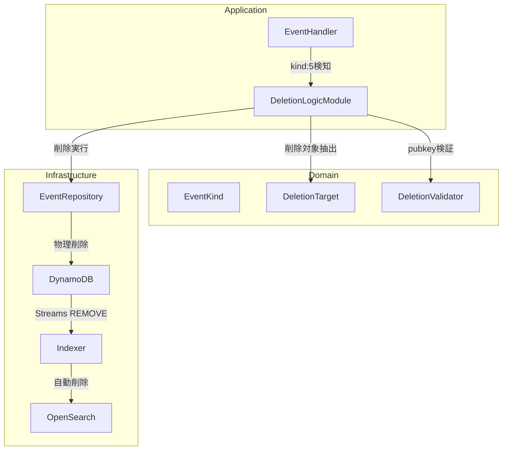
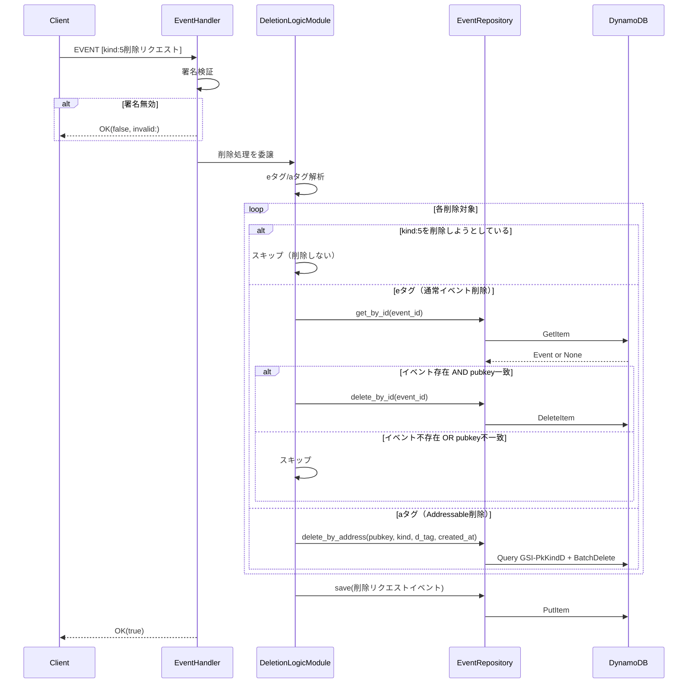
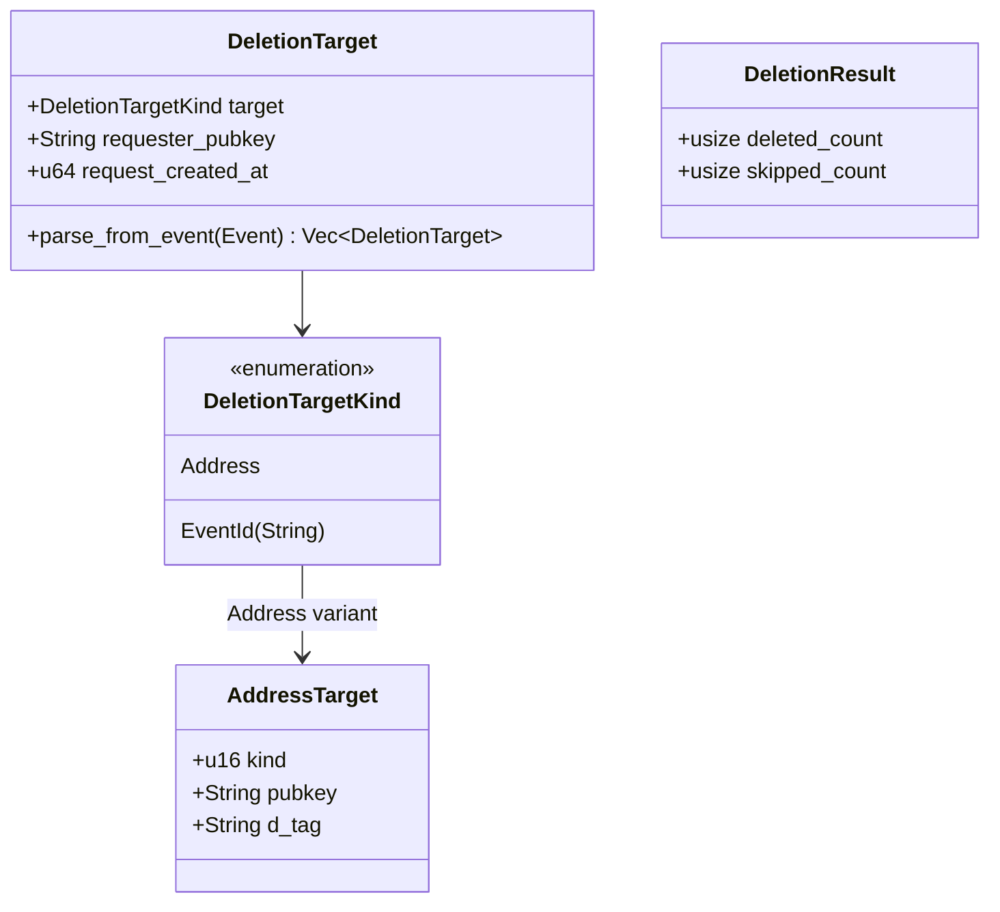

# Design Document

## Overview

**Purpose**: NIP-09（Event Deletion Request）対応により、Nostrユーザーが自身のイベントをリレーから削除できる機能を提供する。

**Users**: Nostrクライアント（アプリ）を通じて、ユーザーは削除リクエスト（kind:5）を送信し、不要になった投稿やメタデータをリレーから物理削除できる。

**Impact**: 既存のEventHandler処理フローにkind:5分岐を追加し、EventRepositoryトレイトに削除メソッドを拡張する。DynamoDB物理削除により、既存のDynamoDB Streams + Indexer経由でOpenSearchからも自動削除される。

### Goals

- kind:5削除リクエストイベントを受信・検証・保存する
- `e`タグで参照される通常イベントをpubkey検証後に物理削除する
- `a`タグで参照されるAddressableイベントをpubkey検証後に物理削除する
- 削除リクエストイベント自体は永続的に保存・配信する
- kind:5イベントを削除対象とする削除リクエストは無視する

### Non-Goals

- 削除対象イベントにマッチするアクティブなサブスクリプションへの即時CLOSED通知（NIP-09で要求されていない）
- 削除リクエストの取り消し機能（unrequest deletion）
- 他リレーへの削除リクエスト伝播（クライアント責務）
- `k`タグの検証・利用（現時点ではRELAY実装として不要）

## Architecture

### Existing Architecture Analysis

現在のリレー実装は3層アーキテクチャ（Domain/Application/Infrastructure）を採用：

- **Domain層**: `EventKind`, `EventValidator`, `RelayMessage` 等のコアロジック
- **Application層**: `EventHandler`, `SubscriptionHandler`, `DefaultHandler` 等のハンドラー
- **Infrastructure層**: `DynamoEventRepository`, `WebSocketSender` 等の外部システム連携

EventHandler は現在、受信したイベントを Kind 分類（Regular/Replaceable/Ephemeral/Addressable）に基づいて処理している。kind:5 は数値的には Regular に分類されるが、特別な削除処理が必要。

### Architecture Pattern & Boundary Map



**Architecture Integration**:
- **Selected pattern**: 既存3層アーキテクチャを維持し、Domain層に削除関連モジュールを追加
- **Domain boundaries**: 削除ロジック（DeletionTarget, DeletionValidator）をDomain層に配置、外部依存を持たない
- **Existing patterns preserved**: EventHandler経由のルーティング、EventRepository抽象化
- **New components rationale**: 削除処理は通常のイベント保存とは異なるロジックを持つため、専用モジュールとして分離
- **Steering compliance**: Rust 3層アーキテクチャ原則を維持

### Technology Stack

| Layer | Choice / Version | Role in Feature | Notes |
|-------|------------------|-----------------|-------|
| Backend / Services | Rust (Edition 2024) | 削除ロジック実装 | 既存技術スタック |
| Data / Storage | DynamoDB | イベント物理削除 | 既存テーブル、新規GSIクエリ不要 |
| Data / Storage | OpenSearch | 自動同期削除 | DynamoDB Streams経由（既存実装） |

## System Flows

### 削除リクエスト処理フロー



**Key Decisions**:
- 削除処理は全て完了してから削除リクエストイベント自体を保存する（途中失敗時も部分削除は維持）
- OpenSearch削除はDynamoDB Streams経由で自動的に行われる（既存Indexer実装を活用）

## Requirements Traceability

| Requirement | Summary | Components | Interfaces | Flows |
|-------------|---------|------------|------------|-------|
| 1.1, 1.4, 1.5 | 削除リクエスト受信・署名検証・OK応答 | EventHandler | handle_with_config | 削除リクエスト処理フロー |
| 1.2, 1.3 | eタグ/aタグの解析・認識 | DeletionTarget | parse_from_event | 削除リクエスト処理フロー |
| 2.1, 2.2, 2.3, 2.4, 2.5 | 通常イベントのpubkey検証・削除 | DeletionValidator, EventRepository | validate_deletion, delete_by_id | 削除リクエスト処理フロー |
| 3.1, 3.2, 3.3, 3.4 | Addressableイベントの削除 | EventRepository | delete_by_address | 削除リクエスト処理フロー |
| 4.1, 4.2, 4.3 | 削除リクエスト自体の保存・配信 | EventHandler, EventRepository | save | 削除リクエスト処理フロー |
| 5.1, 5.2 | kind:5のkind:5削除は無視 | DeletionValidator | is_protected_kind | 削除リクエスト処理フロー |
| 6.1, 6.2 | サブスクリプションへの反映 | EventRepository (物理削除) | - | 物理削除後のクエリで自然に除外 |

## Components and Interfaces

| Component | Domain/Layer | Intent | Req Coverage | Key Dependencies | Contracts |
|-----------|--------------|--------|--------------|------------------|-----------|
| EventHandler (拡張) | Application | kind:5検知と削除処理委譲 | 1.1, 1.4, 1.5, 4.1 | DeletionLogicModule (P0) | Service |
| DeletionLogicModule | Application | 削除処理の統括 | 1.2, 1.3, 2.1-2.4, 3.1-3.3, 5.1-5.2 | DeletionTarget (P0), DeletionValidator (P0), EventRepository (P0) | Service |
| DeletionTarget | Domain | 削除対象の抽出・表現 | 1.2, 1.3 | nostr crate (P1) | Service |
| DeletionValidator | Domain | 削除可否の検証 | 2.2, 3.2, 5.1 | - | Service |
| EventRepository (拡張) | Infrastructure | 削除メソッド追加 | 2.1, 2.4, 2.5, 3.1, 3.3, 3.4, 6.1 | DynamoDB (P0) | Service |

### Domain Layer

#### DeletionTarget

| Field | Detail |
|-------|--------|
| Intent | 削除リクエストイベントから削除対象を抽出し、型安全に表現する |
| Requirements | 1.2, 1.3 |

**Responsibilities & Constraints**
- `e`タグからイベントID、`a`タグからAddressable識別子（kind:pubkey:d_tag）を抽出
- 削除リクエストイベントのpubkeyと`created_at`を保持
- 外部依存なしの純粋なドメインロジック

**Dependencies**
- Inbound: DeletionLogicModule — 削除対象解析 (P0)
- External: nostr crate — Event型からタグを抽出 (P1)

**Contracts**: Service [x]

##### Service Interface

```rust
/// 削除対象の種別
pub enum DeletionTargetKind {
    /// イベントID指定（eタグ）
    EventId(String),
    /// Addressable指定（aタグ）: kind, pubkey, d_tag
    Address {
        kind: u16,
        pubkey: String,
        d_tag: String,
    },
}

/// 削除対象
pub struct DeletionTarget {
    /// 削除対象の種別
    pub target: DeletionTargetKind,
    /// 削除リクエストのpubkey（所有者検証用）
    pub requester_pubkey: String,
    /// 削除リクエストのcreated_at（aタグ削除の時刻境界）
    pub request_created_at: u64,
}

impl DeletionTarget {
    /// 削除リクエストイベントから削除対象リストを抽出
    ///
    /// # Arguments
    /// * `event` - kind:5の削除リクエストイベント
    ///
    /// # Returns
    /// * 抽出された削除対象のリスト（eタグ・aタグ混在可能）
    pub fn parse_from_event(event: &nostr::Event) -> Vec<DeletionTarget>;
}
```

- Preconditions: eventはkind:5であること
- Postconditions: eタグ・aタグが存在しない場合は空のVecを返す
- Invariants: 抽出された全DeletionTargetはevent.pubkeyとevent.created_atを持つ

**Implementation Notes**
- Integration: nostr crateのTag APIを使用してeタグ・aタグを抽出
- Validation:
  - aタグのフォーマット（kind:pubkey:d_tag）をパース、不正な場合はスキップ
  - **aタグ内のpubkeyと削除リクエストイベントのpubkeyを比較し、不一致の場合は削除対象リストに含めずスキップする**（早期フィルタリングによりDeletionLogicModuleでの追加検証が不要）
- Risks: aタグのフォーマットが不正な場合の処理（ログ出力してスキップ）

---

#### DeletionValidator

| Field | Detail |
|-------|--------|
| Intent | 削除操作の可否を検証する純粋関数群 |
| Requirements | 2.2, 3.2, 5.1 |

**Responsibilities & Constraints**
- 削除対象イベントのpubkeyと削除リクエストのpubkeyが一致するか検証
- 削除対象がkind:5（保護対象）かどうか判定
- Addressable削除の時刻境界検証
- 外部依存なしの純粋なドメインロジック

**Dependencies**
- Inbound: DeletionLogicModule — 削除可否判定 (P0)

**Contracts**: Service [x]

##### Service Interface

```rust
pub struct DeletionValidator;

impl DeletionValidator {
    /// pubkeyの一致を検証
    ///
    /// # Arguments
    /// * `target_pubkey` - 削除対象イベントのpubkey
    /// * `requester_pubkey` - 削除リクエストのpubkey
    ///
    /// # Returns
    /// * `true` - 一致（削除可能）
    /// * `false` - 不一致（削除不可）
    pub fn validate_pubkey_match(target_pubkey: &str, requester_pubkey: &str) -> bool;

    /// 削除保護対象のkindかどうか判定
    ///
    /// kind:5は他のkind:5で削除できない（NIP-09仕様）
    ///
    /// # Arguments
    /// * `kind` - 削除対象イベントのkind
    ///
    /// # Returns
    /// * `true` - 保護対象（削除不可）
    /// * `false` - 削除可能
    pub fn is_protected_kind(kind: u16) -> bool;

    /// Addressable削除の時刻境界を検証
    ///
    /// # Arguments
    /// * `event_created_at` - 削除対象イベントのcreated_at
    /// * `request_created_at` - 削除リクエストのcreated_at
    ///
    /// # Returns
    /// * `true` - 削除リクエスト以前（削除対象）
    /// * `false` - 削除リクエスト以降（削除対象外）
    pub fn is_within_deletion_window(event_created_at: u64, request_created_at: u64) -> bool;
}
```

- Preconditions: なし（純粋関数）
- Postconditions: なし
- Invariants: なし

**Implementation Notes**
- Integration: 単純な文字列比較・数値比較のみ
- Validation: なし
- Risks: なし

---

### Application Layer

#### DeletionLogicModule

| Field | Detail |
|-------|--------|
| Intent | kind:5削除リクエストの処理を統括し、削除対象の抽出・検証・削除を実行する |
| Requirements | 1.2, 1.3, 2.1-2.4, 3.1-3.3, 5.1-5.2 |

**Responsibilities & Constraints**
- 削除リクエストイベントから削除対象を抽出
- 各削除対象に対してpubkey検証・kind:5保護検証を実行
- 検証をパスした対象をEventRepository経由で削除
- 削除処理の成功/失敗に関わらず、削除リクエストイベント自体は保存

**Dependencies**
- Inbound: EventHandler — kind:5処理委譲 (P0)
- Outbound: DeletionTarget — 削除対象抽出 (P0)
- Outbound: DeletionValidator — 削除可否検証 (P0)
- Outbound: EventRepository — イベント取得・削除 (P0)

**Contracts**: Service [x]

##### Service Interface

```rust
/// 削除処理結果
pub struct DeletionResult {
    /// 削除に成功したイベント数
    pub deleted_count: usize,
    /// スキップしたイベント数（pubkey不一致、存在しない、kind:5等）
    pub skipped_count: usize,
}

/// 削除ロジックモジュール
pub struct DeletionLogicModule<ER>
where
    ER: EventRepository,
{
    event_repo: ER,
}

impl<ER> DeletionLogicModule<ER>
where
    ER: EventRepository,
{
    /// 新しいDeletionLogicModuleを作成
    pub fn new(event_repo: ER) -> Self;

    /// 削除リクエストイベントを処理
    ///
    /// # Arguments
    /// * `deletion_event` - kind:5の削除リクエストイベント
    ///
    /// # Returns
    /// * `Ok(DeletionResult)` - 削除処理結果
    /// * `Err(DeletionError)` - 処理エラー
    ///
    /// # Processing
    /// 1. 削除対象を抽出（eタグ・aタグ）
    /// 2. 各対象に対して検証・削除を実行
    /// 3. 削除リクエストイベント自体を保存
    pub async fn process_deletion(
        &self,
        deletion_event: &nostr::Event,
    ) -> Result<DeletionResult, DeletionError>;
}

/// 削除処理エラー
#[derive(Debug, Error)]
pub enum DeletionError {
    #[error("Repository error: {0}")]
    RepositoryError(String),
}
```

- Preconditions: deletion_eventはkind:5であること（呼び出し元で保証）
- Postconditions: 削除リクエストイベント自体は常に保存される
- Invariants: 部分的に削除が成功した場合も、成功分は維持される

**Implementation Notes**
- Integration: EventHandler.handle_with_config()からkind:5時に呼び出し
- Validation: DeletionValidatorを使用した検証
- Risks: 大量のeタグ/aタグを含む削除リクエストでのパフォーマンス（現時点では逐次処理）

---

#### EventHandler (拡張)

| Field | Detail |
|-------|--------|
| Intent | 既存のEventHandlerにkind:5検知と削除処理委譲を追加 |
| Requirements | 1.1, 1.4, 1.5, 4.1 |

**Responsibilities & Constraints**
- イベント検証後、kind:5の場合はDeletionLogicModuleに処理を委譲
- 削除処理の成功/失敗に関わらずOK(true)を返す（削除リクエストイベントは保存されるため）
- 既存のKind分類（Regular/Replaceable/Ephemeral/Addressable）ロジックは維持

**Dependencies**
- Outbound: DeletionLogicModule — kind:5処理委譲 (P0)
- Existing: EventRepository, SubscriptionRepository, WebSocketSender

**Contracts**: Service [x] (既存インターフェース拡張)

##### Service Interface (変更点)

```rust
impl<ER, SR, WS> EventHandler<ER, SR, WS>
where
    ER: EventRepository,
    SR: SubscriptionRepository,
    WS: WebSocketSender,
{
    /// EVENTメッセージを処理（制限値設定を指定）
    ///
    /// 変更点: kind:5の場合はDeletionLogicModuleに委譲
    pub async fn handle_with_config(
        &self,
        event_json: Value,
        connection_id: &str,
        config: &LimitationConfig,
    ) -> RelayMessage {
        // 既存の検証処理...

        // kind:5の場合は削除処理に分岐
        if event.kind.as_u16() == 5 {
            return self.handle_deletion(&event, connection_id).await;
        }

        // 既存のKind別処理...
    }

    /// 削除リクエストを処理（内部メソッド）
    async fn handle_deletion(
        &self,
        event: &nostr::Event,
        connection_id: &str,
    ) -> RelayMessage;
}
```

**Implementation Notes**
- Integration: 既存のhandle_with_config()内で条件分岐を追加
- Validation: 署名検証は既存ロジックで実施済み
- Risks: 既存テストへの影響（kind:5のモックテスト追加が必要）

---

### Infrastructure Layer

#### EventRepository (拡張)

| Field | Detail |
|-------|--------|
| Intent | EventRepositoryトレイトに削除メソッドを追加 |
| Requirements | 2.1, 2.4, 2.5, 3.1, 3.3, 3.4, 6.1 |

**Responsibilities & Constraints**
- イベントID指定の物理削除
- Addressable識別子指定の物理削除（時刻境界付き）
- 削除操作はDynamoDBのDeleteItem/BatchWriteを使用
- OpenSearchへの同期はDynamoDB Streams + Indexer経由（既存実装）

**Dependencies**
- Inbound: DeletionLogicModule — 削除操作 (P0)
- External: DynamoDB — 物理削除操作 (P0)

**Contracts**: Service [x]

##### Service Interface (追加メソッド)

```rust
#[async_trait]
pub trait EventRepository: QueryRepository {
    // 既存メソッド...
    async fn save(&self, event: &Event) -> Result<SaveResult, EventRepositoryError>;
    async fn get_by_id(&self, event_id: &str) -> Result<Option<Event>, EventRepositoryError>;

    // 追加メソッド

    /// イベントIDで削除
    ///
    /// # Arguments
    /// * `event_id` - 削除対象のイベントID
    ///
    /// # Returns
    /// * `Ok(true)` - 削除成功
    /// * `Ok(false)` - 対象が存在しなかった
    /// * `Err` - 削除エラー
    ///
    /// # Note
    /// この操作はDynamoDB DeleteItemを実行し、DynamoDB Streams経由で
    /// OpenSearchからも自動的に削除される
    async fn delete_by_id(&self, event_id: &str) -> Result<bool, EventRepositoryError>;

    /// Addressable識別子で削除（時刻境界付き）
    ///
    /// # Arguments
    /// * `pubkey` - 対象のpubkey
    /// * `kind` - 対象のkind
    /// * `d_tag` - 対象のd_tag
    /// * `before_timestamp` - この時刻以前のイベントのみ削除
    ///
    /// # Returns
    /// * `Ok(usize)` - 削除したイベント数
    /// * `Err` - 削除エラー
    ///
    /// # Note
    /// GSI-PkKindDを使用してクエリし、時刻条件に合致するイベントを削除
    async fn delete_by_address(
        &self,
        pubkey: &str,
        kind: u16,
        d_tag: &str,
        before_timestamp: u64,
    ) -> Result<usize, EventRepositoryError>;
}
```

- Preconditions: 有効なイベントID/Addressable識別子
- Postconditions: 削除されたイベントはDynamoDBから物理削除され、OpenSearchからも削除される
- Invariants: 削除操作は冪等（存在しないイベントの削除はエラーではなくfalse/0を返す）

**Implementation Notes**
- Integration: DynamoDB DeleteItem（単一削除）、Query + BatchWrite（Addressable削除）
- Validation: 削除操作自体にpubkey検証は含まない（呼び出し元で検証済み）
- Risks: Addressable削除で大量のイベントが対象になった場合のスループット制限

---

## Data Models

### Domain Model

削除処理で使用するデータ構造：



**Invariants**:
- DeletionTarget.requester_pubkey は常に削除リクエストイベントのpubkey
- DeletionTarget.request_created_at は常に削除リクエストイベントのcreated_at

### Physical Data Model

**DynamoDB操作**:

| Operation | Method | Table/Index | Condition |
|-----------|--------|-------------|-----------|
| 単一イベント削除 | DeleteItem | Events (PK: id) | なし |
| Addressable取得 | Query | GSI-PkKindD (pk_kind_d) | created_at <= request_created_at |
| Addressableバッチ削除 | BatchWriteItem | Events | DeleteRequest (各id) |

**Note**: 既存のGSI-PkKindDを使用し、新規インデックスは不要。

## Error Handling

### Error Strategy

| Error Type | Handling | User Impact |
|------------|----------|-------------|
| 削除対象が存在しない | スキップして継続 | なし（正常終了） |
| pubkey不一致 | スキップして継続 | なし（正常終了） |
| kind:5を削除しようとした | スキップして継続 | なし（正常終了） |
| DynamoDB削除エラー | ログ記録、処理継続 | 一部削除が失敗する可能性 |
| DynamoDB保存エラー（削除リクエスト自体） | エラー応答 | OK(false, error:) |

### Error Categories and Responses

**User Errors (4xx相当)**:
- 署名無効: OK(false, "invalid: signature verification failed")
- イベント構造無効: OK(false, "invalid: ...")

**System Errors (5xx相当)**:
- DynamoDB書き込み失敗: OK(false, "error: failed to store event")

**Business Logic (スキップ)**:
- pubkey不一致、対象不存在、kind:5保護: スキップしてOK(true)

## Testing Strategy

### Unit Tests

- `DeletionTarget::parse_from_event` - eタグ・aタグの抽出、不正フォーマットのスキップ
- `DeletionValidator::validate_pubkey_match` - pubkey一致/不一致の判定
- `DeletionValidator::is_protected_kind` - kind:5の保護判定
- `DeletionValidator::is_within_deletion_window` - 時刻境界の判定
- `DeletionLogicModule::process_deletion` - 削除処理統合（モックリポジトリ使用）

### Integration Tests

- EventHandler経由のkind:5処理フロー
- DynamoEventRepository.delete_by_id - 実DynamoDB削除
- DynamoEventRepository.delete_by_address - GSIクエリ + バッチ削除
- MockEventRepository拡張テスト

### E2E Tests

- WebSocket経由でのkind:5送信→対象イベント削除→REQで削除確認
- 削除リクエストイベント自体のREQ取得

## Security Considerations

- **認可**: pubkey検証により、イベント所有者のみが削除可能
- **DoS対策**: 既存のタグ数制限（LimitationConfig.max_event_tags）が大量削除リクエストを制限
- **監査**: 削除リクエストイベント自体を永続保存することで、削除履歴を追跡可能
