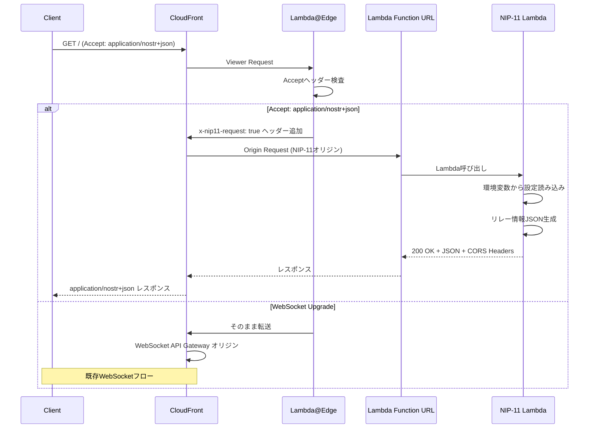
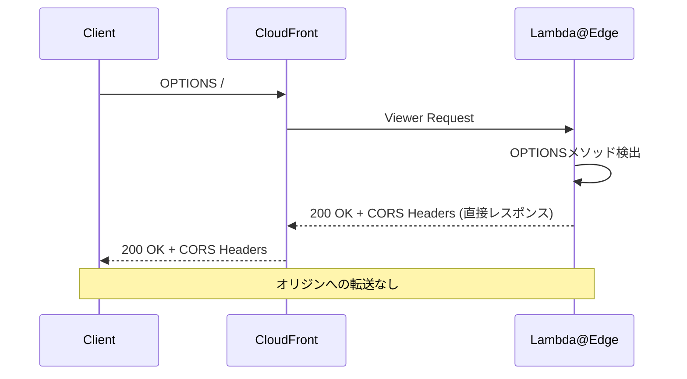

# Design Document

## Overview

**Purpose**: NIP-11（Relay Information Document）機能は、Nostrクライアントがリレーのメタデータを事前に取得できるようにする。これにより、クライアントはリレーの機能、制限、連絡先情報を把握した上で接続判断を行える。

**Users**: Nostrクライアント開発者、リレーアグリゲーター、リレー運営者がこの機能を利用して、リレー情報の自動取得・表示を行う。

**Impact**: 既存のWebSocketインフラストラクチャにCloudFront前段を追加し、HTTPリクエストとWebSocketリクエストを同一ドメインで処理可能にする。

### Goals
- NIP-11仕様に準拠したリレー情報JSONを`Accept: application/nostr+json`ヘッダー付きHTTPリクエストに対して返却
- 環境変数による柔軟なリレーメタデータ設定
- CORS対応によるブラウザベースクライアントのサポート
- 既存のWebSocket接続機能への影響を最小化

### Non-Goals
- リレー制限の動的適用（報告のみ、将来の拡張に委譲）
- 認証機能（NIP-42）の統合
- 課金/ペイメント機能（NIP-57）の統合
- リテンションポリシーの詳細設定

## Architecture

### Existing Architecture Analysis

現在のアーキテクチャ:
```
Client <--WebSocket--> API Gateway v2 <---> Lambda (Rust) <---> DynamoDB
                              |
                         Route53 DNS
                         (relay.nostr.nisshiee.org)
```

**制約事項**（research.md より）:
- AWS API Gateway WebSocket APIとHTTP APIは同一カスタムドメインで共存不可
- WebSocket APIは他のWebSocket APIとのみ同一ドメインで共存可能
- NIP-11は同一URIでHTTPとWebSocketの両方を処理することを要求

### Architecture Pattern & Boundary Map

**選択パターン**: CloudFront + Lambda@Edge + Lambda Function URL

```mermaid
flowchart TB
    subgraph Client
        NC[Nostr Client]
    end

    subgraph CloudFront["CloudFront (relay.nostr.nisshiee.org)"]
        CF[CloudFront Distribution]
        LE[Lambda@Edge<br/>Viewer Request]
    end

    subgraph Origins["Origins"]
        WS[WebSocket API Gateway<br/>Default Origin]
        NIP11[NIP-11 Lambda<br/>Function URL]
    end

    subgraph Lambda["Lambda Functions"]
        CONN[connect]
        DISC[disconnect]
        DEF[default]
        INFO[nip11_info]
    end

    NC -->|HTTP/WebSocket| CF
    CF --> LE
    LE -->|Accept: application/nostr+json| NIP11
    LE -->|WebSocket/Other| WS

    WS --> CONN
    WS --> DISC
    WS --> DEF

    NIP11 --> INFO
```

**Architecture Integration**:
- **選択パターン**: CloudFront + Lambda@Edge + Lambda Function URL（research.md Option B + C の組み合わせ）
- **ドメイン境界**: CloudFrontがルーティング層、Lambda Function URLがNIP-11専用HTTPエンドポイント
- **既存パターン維持**: 3層アーキテクチャ（domain/application/infrastructure）、Lambda関数パターン
- **新規コンポーネント**: `RelayInfoConfig`（設定管理）、`Nip11Handler`（応答生成）、`nip11_info.rs`（Lambdaエントリポイント）
- **ステアリング準拠**: Rustによる実装、環境変数設定、構造化ログ

### Technology Stack

| Layer | Choice / Version | Role in Feature | Notes |
|-------|------------------|-----------------|-------|
| Frontend / CLI | N/A | - | HTTPクライアントからのアクセスのみ |
| Backend / Services | Rust (Edition 2024), `lambda_http` | NIP-11レスポンス生成 | `lambda_runtime`に加えて`lambda_http`クレートを追加 |
| Data / Storage | N/A | - | 設定は環境変数から取得、永続化不要 |
| Messaging / Events | N/A | - | - |
| Infrastructure / Runtime | CloudFront, Lambda@Edge (us-east-1), Lambda Function URL (OAC) | ルーティング、HTTP処理 | CloudFrontによるWebSocket/HTTP分離 |

## System Flows

### NIP-11リクエスト処理フロー



### CORSプリフライトフロー

CORSプリフライトリクエスト（OPTIONS）は `Accept: application/nostr+json` ヘッダーを含まないため、Lambda@Edgeで直接レスポンスを生成する。これによりオリジンへの往復を回避し、低レイテンシを実現。



## Requirements Traceability

| Requirement | Summary | Components | Interfaces | Flows |
|-------------|---------|------------|------------|-------|
| 1.1-1.3 | HTTPリクエストによるリレー情報取得 | Lambda@Edge, NIP-11 Lambda | HTTP GET | NIP-11リクエスト処理フロー |
| 2.1-2.9 | 基本フィールド（name, description, pubkey等） | RelayInfoConfig, Nip11Handler | RelayInfoDocument | - |
| 3.1-3.4 | CORSヘッダー | Lambda@Edge (OPTIONS), Nip11Handler (GET) | HTTP Headers | CORSプリフライトフロー |
| 4.1-4.3 | サーバー制限情報 | RelayInfoConfig | limitation object | - |
| 5.1-5.7 | 設定可能なメタデータ | RelayInfoConfig | Environment Variables | - |
| 6.1-6.3 | AWS統合 | CloudFront, Lambda@Edge, Function URL | Terraform | - |
| 7.1-7.5 | コミュニティ・ロケール情報 | RelayInfoConfig | relay_countries, language_tags | - |

## Components and Interfaces

| Component | Domain/Layer | Intent | Req Coverage | Key Dependencies | Contracts |
|-----------|--------------|--------|--------------|------------------|-----------|
| RelayInfoConfig | Infrastructure | 環境変数からリレー設定を読み込み | 2, 4, 5, 7 | std::env | Service |
| Nip11Handler | Application | NIP-11レスポンス生成（GETのみ） | 1, 2, 3, 4, 7 | RelayInfoConfig | Service, API |
| nip11_info.rs | Bin | Lambda Function URL エントリポイント | 1, 6 | lambda_http, Nip11Handler | - |
| edge-router | Infrastructure (Lambda@Edge) | ルーティング + CORSプリフライト応答 | 1, 3, 6 | CloudFront | - |
| CloudFront | Infrastructure (Terraform) | マルチオリジン配信 | 6 | API Gateway, Function URL | - |

### Infrastructure Layer

#### RelayInfoConfig

| Field | Detail |
|-------|--------|
| Intent | 環境変数からNIP-11レスポンスに必要な設定値を読み込み、型安全に提供する |
| Requirements | 2.1-2.9, 4.1-4.3, 5.1-5.7, 7.1-7.5 |

**Responsibilities & Constraints**
- NIP-11関連の環境変数を読み込み、構造化された設定として提供
- 未設定のオプションフィールドは`None`として扱う
- `max_subid_length`は64固定（現在の実装値）

**Dependencies**
- Inbound: Nip11Handler — 設定値取得 (P0)
- External: std::env — 環境変数読み込み (P0)

**Contracts**: Service [x]

##### Service Interface
```rust
/// リレー情報設定
///
/// NIP-11レスポンスに含める情報を環境変数から読み込む
#[derive(Debug, Clone)]
pub struct RelayInfoConfig {
    // 基本フィールド (要件 2.1-2.9)
    pub name: Option<String>,           // RELAY_NAME
    pub description: Option<String>,    // RELAY_DESCRIPTION
    pub pubkey: Option<String>,         // RELAY_PUBKEY (32-byte hex)
    pub contact: Option<String>,        // RELAY_CONTACT (mailto: or https:)
    pub icon: Option<String>,           // RELAY_ICON (URL)
    pub banner: Option<String>,         // RELAY_BANNER (URL)

    // コミュニティ・ロケール (要件 7.1-7.5)
    pub relay_countries: Vec<String>,   // RELAY_COUNTRIES (カンマ区切り)
    pub language_tags: Vec<String>,     // RELAY_LANGUAGE_TAGS (カンマ区切り)
}

impl RelayInfoConfig {
    /// 環境変数から設定を読み込み
    pub fn from_env() -> Self;

    /// テスト用に明示的な値で作成
    pub fn new(
        name: Option<String>,
        description: Option<String>,
        pubkey: Option<String>,
        contact: Option<String>,
        icon: Option<String>,
        banner: Option<String>,
        relay_countries: Vec<String>,
        language_tags: Vec<String>,
    ) -> Self;
}
```

- Preconditions: なし（環境変数未設定時はデフォルト値使用）
- Postconditions: 有効な設定インスタンスを返却
- Invariants: `max_subid_length`は常に64（※共通定数化は別タスクとして対応予定）

**Implementation Notes**
- Integration: `DynamoDbConfig`と同様のパターンで環境変数を読み込む
- Validation: pubkeyは64文字のhex文字列であることを検証（設定時のみ）
- Risks: 環境変数の設定漏れによる不完全なレスポンス（許容範囲）

### Application Layer

#### edge-router (Lambda@Edge)

| Field | Detail |
|-------|--------|
| Intent | リクエストルーティングとCORSプリフライト応答をエッジで処理 |
| Requirements | 1.1-1.3, 3.4, 6.1-6.3 |

**Responsibilities & Constraints**
- OPTIONSリクエストに対してCORSヘッダー付きレスポンスを直接生成（オリジン転送なし）
- `Accept: application/nostr+json`ヘッダー検出時にNIP-11オリジンへルーティング
- その他のリクエストはWebSocket API Gatewayへ転送
- us-east-1リージョンにデプロイ必須（Lambda@Edge制約）

**Dependencies**
- Inbound: CloudFront — Viewer Request イベント (P0)
- Outbound: NIP-11 Lambda Function URL, WebSocket API Gateway — オリジン選択 (P0)

**Contracts**: Service [x]

##### Service Interface (JavaScript)
```javascript
// edge-router/index.js
exports.handler = async (event) => {
    const request = event.Records[0].cf.request;
    const headers = request.headers;
    const method = request.method;

    // OPTIONSプリフライトは直接レスポンス（オリジン転送なし）
    if (method === 'OPTIONS') {
        return {
            status: '200',
            statusDescription: 'OK',
            headers: {
                'access-control-allow-origin': [{ value: '*' }],
                'access-control-allow-methods': [{ value: 'GET, OPTIONS' }],
                'access-control-allow-headers': [{ value: 'Accept' }],
                'access-control-max-age': [{ value: '86400' }],
            },
            body: '',
        };
    }

    // Accept: application/nostr+json をチェック
    const acceptHeader = headers['accept'];
    if (acceptHeader && acceptHeader.some(h =>
        h.value.includes('application/nostr+json'))) {
        // NIP-11オリジンへルーティング
        request.origin = {
            custom: {
                domainName: '${nip11_function_url_domain}',
                port: 443,
                protocol: 'https',
                path: '',
                sslProtocols: ['TLSv1.2'],
                readTimeout: 30,
                keepaliveTimeout: 5
            }
        };
        request.headers['host'] = [{
            key: 'Host',
            value: '${nip11_function_url_domain}'
        }];
    }

    // デフォルト: WebSocket API Gatewayへ転送
    return request;
};
```

**Implementation Notes**
- Integration: CloudFront Viewer Request イベントで実行
- Validation: OPTIONSメソッドを最優先でチェック
- Language: JavaScript（Lambda@Edgeの制約を考慮し、シンプルなルーティング処理に適した言語として採用）
- Risks: Lambda@Edgeはus-east-1のみ、環境変数使用不可
- Domain Embedding: NIP-11 Lambda Function URLのドメイン名はTerraform `templatefile`関数を使用してビルド時に埋め込む

---

#### Nip11Handler

| Field | Detail |
|-------|--------|
| Intent | NIP-11仕様に準拠したリレー情報JSONとCORSヘッダーを生成する（GETリクエストのみ） |
| Requirements | 1.1-1.3, 2.1-2.9, 3.1-3.3, 4.1-4.3, 7.1-7.5 |

**Responsibilities & Constraints**
- NIP-11準拠のJSONレスポンス生成
- GETレスポンスにCORSヘッダー付与（全オリジン許可）
- OPTIONSリクエストはLambda@Edgeで処理済みのため到達しない

**Dependencies**
- Inbound: nip11_info Lambda — HTTP処理 (P0)
- Outbound: RelayInfoConfig — 設定取得 (P0)

**Contracts**: Service [x] / API [x]

##### Service Interface
```rust
/// NIP-11ハンドラー
pub struct Nip11Handler {
    config: RelayInfoConfig,
}

impl Nip11Handler {
    /// 新しいハンドラーを作成
    pub fn new(config: RelayInfoConfig) -> Self;

    /// GETリクエストを処理してレスポンスを生成
    pub fn handle(&self, request: &Request) -> Response<Body>;

    /// リレー情報JSONを生成
    fn build_relay_info(&self) -> RelayInfoDocument;

    /// CORSヘッダーを生成
    fn build_cors_headers() -> HeaderMap;
}
```

##### API Contract

| Method | Endpoint | Request | Response | Errors |
|--------|----------|---------|----------|--------|
| GET | / | Accept: application/nostr+json | RelayInfoDocument (JSON) | - |

**Note**: OPTIONSリクエストはLambda@Edgeで処理されるため、このコンポーネントには到達しない。

**Response Headers (GET)**:
```
Content-Type: application/nostr+json
Access-Control-Allow-Origin: *
Access-Control-Allow-Headers: Accept
Access-Control-Allow-Methods: GET, OPTIONS
```

**Implementation Notes**
- Integration: `lambda_http`クレートの`Request`/`Response`型を使用
- Validation: Lambda@Edgeでルーティング済みのため、Acceptヘッダー検証は省略可能
- Risks: なし（シンプルなGETレスポンス生成のみ）

## Data Models

### Domain Model

#### RelayInfoDocument

NIP-11レスポンスの構造を表す値オブジェクト:

```rust
use serde::Serialize;

/// NIP-11リレー情報ドキュメント
#[derive(Debug, Clone, Serialize)]
pub struct RelayInfoDocument {
    // 基本フィールド (要件 2.1-2.9)
    #[serde(skip_serializing_if = "Option::is_none")]
    pub name: Option<String>,

    #[serde(skip_serializing_if = "Option::is_none")]
    pub description: Option<String>,

    #[serde(skip_serializing_if = "Option::is_none")]
    pub pubkey: Option<String>,

    #[serde(skip_serializing_if = "Option::is_none")]
    pub contact: Option<String>,

    pub supported_nips: Vec<u32>,

    pub software: String,  // 固定値: リポジトリURL

    pub version: String,   // 固定値: Cargo.tomlから取得

    #[serde(skip_serializing_if = "Option::is_none")]
    pub icon: Option<String>,

    #[serde(skip_serializing_if = "Option::is_none")]
    pub banner: Option<String>,

    // 制限情報 (要件 4.1-4.3)
    pub limitation: RelayLimitation,

    // コミュニティ・ロケール (要件 7.1-7.5)
    #[serde(skip_serializing_if = "Vec::is_empty")]
    pub relay_countries: Vec<String>,

    #[serde(skip_serializing_if = "Vec::is_empty")]
    pub language_tags: Vec<String>,
}

/// リレー制限情報
#[derive(Debug, Clone, Serialize)]
pub struct RelayLimitation {
    pub max_subid_length: u32,  // 固定値: 64
}
```

**ビジネスルール**:
- `supported_nips`: 現在実装済みのNIP番号（1, 11）。手動管理とし、NIP追加時の更新手順は`.kiro/steering/`またはCLAUDE.mdに記載する
- `software`: `"https://github.com/nisshiee/my-nostr-relay"` 固定
- `version`: `env!("CARGO_PKG_VERSION")` でコンパイル時に取得
- `max_subid_length`: 64 固定（subscription_handler.rsの実装と一致）。共通定数化は本機能スコープ外とし、別タスクで対応予定

### Data Contracts & Integration

**環境変数スキーマ**:

| Variable | Type | Required | Default | Example |
|----------|------|----------|---------|---------|
| RELAY_NAME | String | No | - | "My Nostr Relay" |
| RELAY_DESCRIPTION | String | No | - | "A personal Nostr relay" |
| RELAY_PUBKEY | String (64 hex) | No | - | "aabbcc..." |
| RELAY_CONTACT | String (URI) | No | - | "mailto:admin@example.com" |
| RELAY_ICON | String (URL) | No | - | "https://example.com/icon.png" |
| RELAY_BANNER | String (URL) | No | - | "https://example.com/banner.png" |
| RELAY_COUNTRIES | String (CSV) | No | "JP" | "JP,US" |
| RELAY_LANGUAGE_TAGS | String (CSV) | No | "ja" | "ja,en" |

## Error Handling

### Error Strategy

NIP-11エンドポイントは可用性を重視し、設定エラーでもデフォルト値で応答する戦略を採用。

### Error Categories and Responses

**System Errors (5xx)**:
- Lambda初期化エラー → CloudWatch Logsに記録、500レスポンス
- 環境変数読み込みエラー → デフォルト値で続行（ログ出力）

**Client Errors (4xx)**:
- 無効なAcceptヘッダー → Lambda@Edgeでフィルタリング済みのため通常到達しない

### Monitoring

- CloudWatch Logs: Lambda関数の実行ログ（構造化JSON形式）
- CloudFront Access Logs: リクエスト統計
- メトリクス: Lambda呼び出し回数、レイテンシ、エラー率

## Testing Strategy

### Unit Tests (Rust)

1. **RelayInfoConfig**:
   - `from_env`で環境変数から正しく読み込み
   - 未設定のオプションフィールドが`None`になる
   - カンマ区切り値の正しいパース

2. **Nip11Handler**:
   - GETリクエストで正しいJSONレスポンス生成
   - CORSヘッダーがGETレスポンスに含まれる

3. **RelayInfoDocument**:
   - JSON シリアライズが NIP-11 仕様に準拠
   - `skip_serializing_if`で未設定フィールドが省略される
   - `supported_nips`に正しい値が含まれる

### Unit Tests (JavaScript - Lambda@Edge)

1. **edge-router**:
   - OPTIONSリクエストでCORSヘッダー付き200レスポンスを直接返却
   - `Accept: application/nostr+json`ヘッダーでNIP-11オリジンに切り替え
   - Acceptヘッダーなしでデフォルトオリジン（WebSocket）を維持
   - WebSocket Upgradeヘッダーでデフォルトオリジンを維持

### Integration Tests

1. **Lambda Function URL統合**:
   - `lambda_http`経由でのリクエスト/レスポンス処理
   - 環境変数からの設定読み込みと応答生成

2. **CloudFront + Lambda@Edge統合**（手動テスト）:
   - `Accept: application/nostr+json`ヘッダーでNIP-11オリジンへルーティング
   - OPTIONSリクエストでCORSプリフライト応答
   - WebSocketリクエストがAPI Gatewayへルーティング

### E2E Tests (手動)

1. **CORSプリフライト**:
   ```bash
   curl -X OPTIONS https://relay.nostr.nisshiee.org/ -v
   # 期待: 200 OK + Access-Control-Allow-* ヘッダー
   ```

2. **NIP-11リクエスト**:
   ```bash
   curl -H "Accept: application/nostr+json" https://relay.nostr.nisshiee.org/
   # 期待: JSON + Content-Type: application/nostr+json
   ```

3. **WebSocket接続**（既存機能の回帰テスト）:
   ```bash
   websocat wss://relay.nostr.nisshiee.org
   # 期待: WebSocket接続成功
   ```

## Infrastructure Design

### Terraform変更概要

```hcl
# terraform/modules/api/nip11.tf (新規)

# NIP-11 Lambda Function
resource "aws_lambda_function" "nip11_info" {
  function_name = "nostr_relay_nip11_info"
  role          = aws_iam_role.lambda_exec.arn
  handler       = "bootstrap"
  runtime       = "provided.al2023"
  # ...

  environment {
    variables = {
      RELAY_NAME        = var.relay_name
      RELAY_DESCRIPTION = var.relay_description
      # ... その他のNIP-11設定
    }
  }
}

# Lambda Function URL
resource "aws_lambda_function_url" "nip11_info" {
  function_name      = aws_lambda_function.nip11_info.function_name
  authorization_type = "AWS_IAM"  # OAC使用
}

# CloudFront OAC
resource "aws_cloudfront_origin_access_control" "nip11" {
  name                              = "nip11-oac"
  origin_access_control_origin_type = "lambda"
  signing_behavior                  = "always"
  signing_protocol                  = "sigv4"
}
```

```hcl
# terraform/modules/api/cloudfront.tf (新規)

resource "aws_cloudfront_distribution" "relay" {
  enabled = true
  aliases = ["relay.${var.domain_name}"]

  # デフォルトオリジン: WebSocket API Gateway
  origin {
    domain_name = replace(aws_apigatewayv2_api.relay.api_endpoint, "wss://", "")
    origin_id   = "websocket"
    # ...
  }

  # NIP-11オリジン: Lambda Function URL
  origin {
    domain_name = replace(aws_lambda_function_url.nip11_info.function_url, "https://", "")
    origin_id   = "nip11"
    origin_access_control_id = aws_cloudfront_origin_access_control.nip11.id
    # ...
  }

  default_cache_behavior {
    target_origin_id = "websocket"
    # Lambda@Edgeでルーティング
    lambda_function_association {
      event_type   = "viewer-request"
      lambda_arn   = aws_lambda_function.edge_router.qualified_arn
    }
  }
}
```

```hcl
# terraform/modules/api/lambda_edge.tf (新規)

provider "aws" {
  alias  = "us_east_1"
  region = "us-east-1"  # Lambda@Edge必須
}

resource "aws_lambda_function" "edge_router" {
  provider = aws.us_east_1
  # ...
}
```

### Lambda@Edge ルーティングロジック

edge-routerコンポーネント（Components and Interfaces セクション参照）として実装。

**主要機能**:
1. **OPTIONSプリフライト応答**: オリジン転送なしでCORSヘッダー付き200レスポンスを直接生成
2. **NIP-11ルーティング**: `Accept: application/nostr+json`ヘッダー検出時にNIP-11オリジンへ転送
3. **デフォルトルーティング**: その他のリクエストはWebSocket API Gatewayへ転送

## Security Considerations

- **OAC (Origin Access Control)**: Lambda Function URLへのアクセスはCloudFrontからのみ許可
- **CORS**: 全オリジン許可（`*`）はNIP-11仕様の要件
- **入力検証**: Acceptヘッダーのみ検証、悪意のあるペイロードの影響なし（GETのみ）

## Performance & Scalability

- **レイテンシ目標**: < 100ms（CloudFrontエッジキャッシュ + Lambda Function URL）
- **キャッシュ戦略**: CloudFrontでTTL設定可能（環境変数変更時はキャッシュ無効化）
- **コールドスタート**: Rust Lambda + provided.al2023 で最小化（< 50ms推定）
