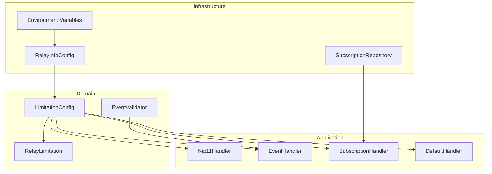
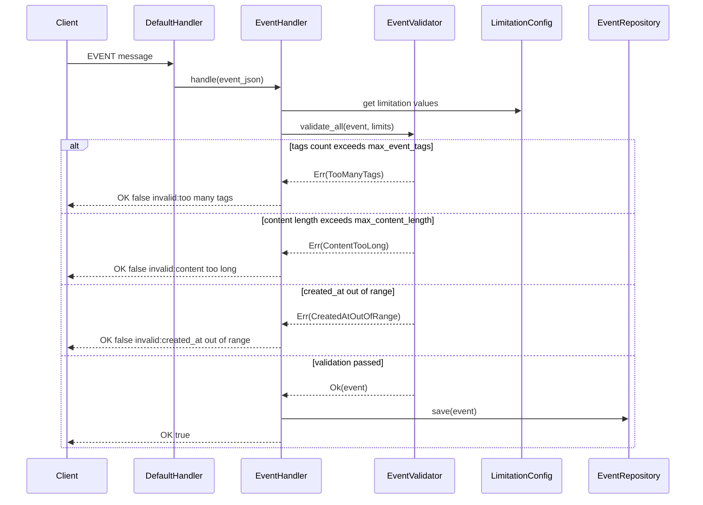
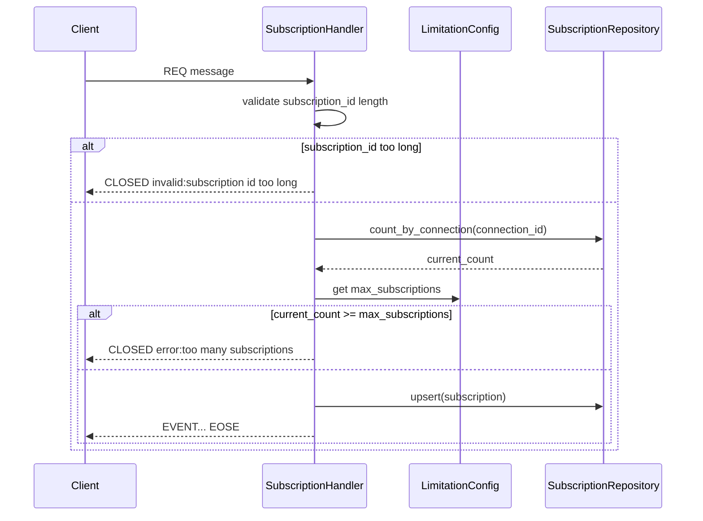

# Technical Design Document

## Overview

**Purpose**: NIP-11 `limitation`オブジェクトを拡張し、リレーの各種制限値をクライアントに公開する機能を提供する。これにより、クライアントはリレーの制限を事前に把握し、適切なリクエストを送信できるようになる。

**Users**: Nostrクライアントアプリケーション、リレー運用者がこの機能を利用する。クライアントはNIP-11レスポンスから制限情報を取得し、リレー運用者は環境変数で制限値を設定する。

**Impact**: 現在`max_subid_length`のみを返している`limitation`オブジェクトに8つのフィールドを追加し、対応するバリデーションロジックをイベント処理・サブスクリプション処理に組み込む。

### Goals

- NIP-11 `limitation`オブジェクトに全制限フィールドを追加
- 全制限値を環境変数で設定可能にする
- 公開した制限値を実際のリクエスト処理に適用する
- 既存の3層アーキテクチャパターンを維持

### Non-Goals

- `auth_required`（NIP-42認証は未実装）
- `payment_required`（有料機能は未実装）
- `restricted_writes`（書き込み制限は未実装）
- `min_pow_difficulty`（PoW要件は未実装）
- retention（イベント保持期間設定）

## Architecture

### Existing Architecture Analysis

現在の実装は以下の3層アーキテクチャに従っている:

- **Domain層** (`src/domain/`): `RelayInfoDocument`, `RelayLimitation`, `EventValidator`等のビジネスロジック
- **Application層** (`src/application/`): `Nip11Handler`, `EventHandler`, `SubscriptionHandler`等のユースケース
- **Infrastructure層** (`src/infrastructure/`): `RelayInfoConfig`, `DynamoDbConfig`, Repository実装

NIP-11関連の現在のフロー:
1. `RelayInfoConfig::from_env()` が環境変数から設定を読み込み
2. `Nip11Handler` が `RelayInfoConfig` から `RelayInfoDocument` を構築
3. `RelayInfoDocument` がJSONシリアライズされてレスポンス

### Architecture Pattern and Boundary Map



**Architecture Integration**:
- **Selected pattern**: 既存の3層アーキテクチャを継続
- **Domain/feature boundaries**: 制限値は新規`LimitationConfig`ドメインモデルで管理、バリデーションは既存`EventValidator`を拡張
- **Existing patterns preserved**: 環境変数からの設定読み込み、ドメインモデルのシリアライズ、ハンドラーによるビジネスフロー実行
- **New components rationale**: `LimitationConfig`は制限値の一元管理と型安全性のため新規追加
- **Steering compliance**: 3層アーキテクチャ、Rustの型安全性、外部依存なしのDomain層

### Technology Stack

| Layer | Choice / Version | Role in Feature | Notes |
|-------|------------------|-----------------|-------|
| Backend / Services | Rust (Edition 2024) | 制限値管理、バリデーション、NIP-11レスポンス生成 | 既存スタック維持 |
| Data / Storage | DynamoDB | サブスクリプション数のカウント取得 | 既存テーブル利用 |
| Infrastructure / Runtime | AWS Lambda | WebSocketメッセージサイズ制限 | API Gateway統合 |

## System Flows

### イベント投稿時のバリデーションフロー



### サブスクリプション作成時の制限チェックフロー



## Requirements Traceability

| Requirement | Summary | Components | Interfaces | Flows |
|-------------|---------|------------|------------|-------|
| 1.1-1.6 | 基本limitationフィールド公開 | RelayLimitation, LimitationConfig, Nip11Handler | RelayLimitation::serialize | - |
| 1.7-1.8 | created_at制限フィールド公開 | RelayLimitation, LimitationConfig | RelayLimitation::serialize | - |
| 1.9-1.10 | default_limitフィールドとREQ適用 | RelayLimitation, LimitationConfig, SubscriptionHandler | SubscriptionHandler::extract_limit | - |
| 2.1-2.9 | 環境変数からの設定読み込み | LimitationConfig, RelayInfoConfig | LimitationConfig::from_env | - |
| 3.1 | max_message_length適用 | API Gateway / Lambda設定 | - | WebSocket受信 |
| 3.2 | max_subscriptions適用 | SubscriptionHandler, SubscriptionRepository | SubscriptionRepository::count_by_connection | サブスクリプション作成フロー |
| 3.3 | max_limitクランプ | SubscriptionHandler | SubscriptionHandler::clamp_limit | - |
| 3.4-3.5 | イベントタグ・コンテンツ長検証 | EventValidator, EventHandler | EventValidator::validate_limitation | イベント投稿フロー |
| 3.6-3.7 | created_at範囲検証 | EventValidator, EventHandler | EventValidator::validate_limitation | イベント投稿フロー |
| 4.1-4.3 | max_subid_length検証とCLOSED応答 | SubscriptionHandler | SubscriptionHandler::validate_subscription_id | サブスクリプション作成フロー |

## Components and Interfaces

| Component | Domain/Layer | Intent | Req Coverage | Key Dependencies | Contracts |
|-----------|--------------|--------|--------------|------------------|-----------|
| LimitationConfig | Domain | 制限値の型安全な保持と環境変数からの読み込み | 2.1-2.9 | 環境変数 (P1) | State |
| RelayLimitation | Domain | NIP-11 limitation JSONシリアライズ | 1.1-1.10 | LimitationConfig (P0) | State |
| EventValidator | Domain | イベント制限バリデーション拡張 | 3.4-3.7 | LimitationConfig (P0) | Service |
| SubscriptionHandler | Application | サブスクリプション制限適用 | 3.2, 3.3, 4.1-4.3, 1.10 | LimitationConfig (P0), SubscriptionRepository (P0) | Service |
| Nip11Handler | Application | limitation付きNIP-11レスポンス生成 | 1.1-1.10 | LimitationConfig (P0), RelayLimitation (P0) | Service |
| SubscriptionRepository | Infrastructure | サブスクリプション数カウント機能追加 | 3.2 | DynamoDB (P0) | Service |

### Domain

#### LimitationConfig

| Field | Detail |
|-------|--------|
| Intent | 全制限値を型安全に保持し、環境変数からの読み込みとデフォルト値を提供 |
| Requirements | 2.1, 2.2, 2.3, 2.4, 2.5, 2.6, 2.7, 2.8, 2.9 |

**Responsibilities and Constraints**
- 9つの制限値フィールドを保持（max_message_length, max_subscriptions, max_limit, max_event_tags, max_content_length, max_subid_length, created_at_lower_limit, created_at_upper_limit, default_limit）
- 環境変数未設定時のデフォルト値を提供
- 不変データとして設計（アプリケーション起動時に一度だけ初期化）

**Dependencies**
- External: 環境変数 (P1)

**Contracts**: State [x]

##### State Management

```rust
/// 制限値設定（Domain層）
#[derive(Debug, Clone)]
pub struct LimitationConfig {
    /// WebSocketメッセージの最大バイト数
    pub max_message_length: u32,
    /// 1接続あたりの最大サブスクリプション数
    pub max_subscriptions: u32,
    /// フィルターlimitの最大値
    pub max_limit: u32,
    /// イベントの最大タグ数
    pub max_event_tags: u32,
    /// コンテンツの最大文字数
    pub max_content_length: u32,
    /// サブスクリプションIDの最大長（64固定）
    pub max_subid_length: u32,
    /// 過去のcreated_at許容範囲（秒）
    pub created_at_lower_limit: u64,
    /// 未来のcreated_at許容範囲（秒）
    pub created_at_upper_limit: u64,
    /// limitが指定されない場合のデフォルト値
    pub default_limit: u32,
}

impl LimitationConfig {
    /// 環境変数から設定を読み込み
    /// 未設定の場合はデフォルト値を使用
    pub fn from_env() -> Self;

    /// デフォルト値で初期化
    pub fn default() -> Self;
}
```

**Default Values**:

| Field | Default | Env Variable |
|-------|---------|--------------|
| max_message_length | 131072 (128KB) | RELAY_MAX_MESSAGE_LENGTH |
| max_subscriptions | 20 | RELAY_MAX_SUBSCRIPTIONS |
| max_limit | 5000 | RELAY_MAX_LIMIT |
| max_event_tags | 1000 | RELAY_MAX_EVENT_TAGS |
| max_content_length | 65536 (64KB) | RELAY_MAX_CONTENT_LENGTH |
| max_subid_length | 64 | （固定値、環境変数なし） |
| created_at_lower_limit | 31536000 (1年) | RELAY_CREATED_AT_LOWER_LIMIT |
| created_at_upper_limit | 900 (15分) | RELAY_CREATED_AT_UPPER_LIMIT |
| default_limit | 100 | RELAY_DEFAULT_LIMIT |

**Implementation Notes**
- Integration: `RelayInfoConfig`の`from_env()`内で`LimitationConfig::from_env()`を呼び出し
- Validation: 環境変数パースエラー時はデフォルト値にフォールバック（サービス継続優先）
- Risks: 環境変数名の typo によるデフォルト値適用 - ログ出力で検知可能にする
- Constraint: `max_message_length`のデフォルト値128KBはAWS API Gateway v2 WebSocketのメッセージサイズ上限（固定値、設定変更不可）に合わせている

---

#### RelayLimitation (拡張)

| Field | Detail |
|-------|--------|
| Intent | NIP-11 limitation JSONをシリアライズ可能な形式で保持 |
| Requirements | 1.1, 1.2, 1.3, 1.4, 1.5, 1.6, 1.7, 1.8, 1.9 |

**Responsibilities and Constraints**
- 既存の`max_subid_length`に加え、8つのフィールドを追加
- `LimitationConfig`から構築
- Serdeによるシリアライズ

**Dependencies**
- Inbound: LimitationConfig (P0)

**Contracts**: State [x]

##### State Management

```rust
/// NIP-11 limitation オブジェクト
#[derive(Debug, Clone, Serialize)]
pub struct RelayLimitation {
    /// WebSocketメッセージの最大バイト数
    pub max_message_length: u32,
    /// 1接続あたりの最大サブスクリプション数
    pub max_subscriptions: u32,
    /// フィルターlimitの最大値
    pub max_limit: u32,
    /// イベントの最大タグ数
    pub max_event_tags: u32,
    /// コンテンツの最大文字数
    pub max_content_length: u32,
    /// サブスクリプションIDの最大長
    pub max_subid_length: u32,
    /// 過去のcreated_at許容範囲（秒）
    pub created_at_lower_limit: u64,
    /// 未来のcreated_at許容範囲（秒）
    pub created_at_upper_limit: u64,
    /// デフォルトlimit値
    pub default_limit: u32,
}

impl RelayLimitation {
    /// LimitationConfigから構築
    pub fn from_config(config: &LimitationConfig) -> Self;
}
```

---

#### EventValidator (拡張)

| Field | Detail |
|-------|--------|
| Intent | イベントの制限値バリデーションを追加 |
| Requirements | 3.4, 3.5, 3.6, 3.7 |

**Responsibilities and Constraints**
- 既存の構造・ID・署名バリデーションに加え、制限値バリデーションを追加
- バリデーション順序: 構造 → ID → 署名 → 制限値
- エラー時は適切な`ValidationError`バリアントを返す

**Dependencies**
- Inbound: LimitationConfig (P0)

**Contracts**: Service [x]

##### Service Interface

```rust
impl EventValidator {
    /// 制限値に基づくバリデーション（既存validate_all内で呼び出し）
    ///
    /// # チェック項目
    /// - tags配列の要素数が max_event_tags 以下
    /// - content文字数が max_content_length 以下
    /// - created_at が (現在時刻 - created_at_lower_limit) 以上
    /// - created_at が (現在時刻 + created_at_upper_limit) 以下
    pub fn validate_limitation(
        event: &Event,
        config: &LimitationConfig,
    ) -> Result<(), ValidationError>;
}

/// ValidationError拡張
#[derive(Debug, Clone, PartialEq, Error)]
pub enum ValidationError {
    // ... 既存バリアント ...

    /// タグ数が制限を超過
    #[error("too many tags: {count} exceeds limit {limit}")]
    TooManyTags { count: usize, limit: u32 },

    /// コンテンツ長が制限を超過
    #[error("content too long: {length} characters exceeds limit {limit}")]
    ContentTooLong { length: usize, limit: u32 },

    /// created_atが過去すぎる
    #[error("created_at too old: event is {age} seconds old, limit is {limit}")]
    CreatedAtTooOld { age: u64, limit: u64 },

    /// created_atが未来すぎる
    #[error("created_at too far in future: {ahead} seconds ahead, limit is {limit}")]
    CreatedAtTooFarInFuture { ahead: u64, limit: u64 },
}
```

**Implementation Notes**
- Integration: `validate_all`の最後で`validate_limitation`を呼び出す
- Validation: 文字数カウントは`content.chars().count()`（Unicode文字数）
- Risks: 時刻ずれによる誤拒否 - `created_at_upper_limit`のデフォルト値を15分と余裕を持たせる

---

### Application

#### SubscriptionHandler (拡張)

| Field | Detail |
|-------|--------|
| Intent | サブスクリプション数制限とlimitクランプを適用 |
| Requirements | 3.2, 3.3, 4.1, 4.2, 4.3, 1.10 |

**Responsibilities and Constraints**
- REQ処理前にサブスクリプション数を確認
- max_subscriptions超過時はCLOSEDメッセージで拒否
- フィルターのlimit値をmax_limitでクランプ
- limit未指定時はdefault_limitを適用
- subscription_id長の検証は既存ロジックを維持

**Dependencies**
- Inbound: LimitationConfig (P0)
- Outbound: SubscriptionRepository (P0), WebSocketSender (P0)

**Contracts**: Service [x]

##### Service Interface

```rust
impl<ER, SR, WS> SubscriptionHandler<ER, SR, WS> {
    /// REQメッセージ処理（拡張）
    ///
    /// # 追加処理
    /// 1. サブスクリプション数チェック（新規のみ）
    /// 2. フィルターlimitのクランプ
    /// 3. limit未指定時のdefault_limit適用
    pub async fn handle_req(
        &self,
        subscription_id: String,
        filter_values: Vec<Value>,
        connection_id: &str,
        config: &LimitationConfig,
    ) -> Result<(), SubscriptionHandlerError>;

    /// フィルターのlimitをクランプ
    fn clamp_limit(&self, filters: &mut [Filter], config: &LimitationConfig);

    /// limit未指定フィルターにdefault_limitを適用
    fn apply_default_limit(&self, filters: &mut [Filter], config: &LimitationConfig);
}

/// SubscriptionHandlerError拡張
#[derive(Debug, Clone, Error)]
pub enum SubscriptionHandlerError {
    // ... 既存バリアント ...

    /// サブスクリプション数上限超過
    #[error("too many subscriptions: {current} active, limit is {limit}")]
    TooManySubscriptions { current: usize, limit: u32 },
}
```

**Implementation Notes**
- Integration: `handle_req`の冒頭でサブスクリプション数チェックを追加
- Validation: 既存サブスクリプションの置換時はカウント増加なしと判定
  - 処理順序: (1) subscription_id長チェック → (2) 同一subscription_idの既存レコード確認 → (3) 新規の場合のみサブスクリプション数チェック → (4) upsert実行
  - 既存subscription_idへのREQ（フィルター更新）は、カウントチェックをスキップして直接upsertに進む
  - これによりクライアントがフィルター更新のためREQを再送した際に「too many subscriptions」で拒否されるリグレッションを防ぐ
- Risks: DynamoDBクエリ追加によるレイテンシ増 - 個人用リレー規模では許容範囲

---

#### Nip11Handler (拡張)

| Field | Detail |
|-------|--------|
| Intent | 拡張されたlimitationを含むNIP-11レスポンスを生成 |
| Requirements | 1.1, 1.2, 1.3, 1.4, 1.5, 1.6, 1.7, 1.8, 1.9 |

**Responsibilities and Constraints**
- `LimitationConfig`から`RelayLimitation`を構築
- `RelayInfoDocument`にlimitationを設定

**Dependencies**
- Inbound: RelayInfoConfig (P0), LimitationConfig (P0)
- Outbound: RelayLimitation (P0)

**Contracts**: Service [x]

##### Service Interface

```rust
impl Nip11Handler {
    /// 新しいハンドラーを作成（拡張）
    pub fn new(config: RelayInfoConfig, limitation_config: LimitationConfig) -> Self;

    /// リレー情報ドキュメントを生成（拡張）
    /// LimitationConfigからRelayLimitationを構築
    pub fn build_relay_info(&self) -> RelayInfoDocument;
}
```

**Implementation Notes**
- Integration: `RelayInfoDocument::new`の引数に`RelayLimitation`を追加
- Validation: なし（設定値をそのまま出力）

---

### Infrastructure

#### SubscriptionRepository (拡張)

| Field | Detail |
|-------|--------|
| Intent | 接続ごとのサブスクリプション数カウント機能を追加 |
| Requirements | 3.2 |

**Responsibilities and Constraints**
- 既存のupsert/delete/find_matching機能を維持
- 新規にサブスクリプション存在確認機能を追加（更新時のカウントスキップ判定用）
- 新規に接続IDでのサブスクリプション数カウント機能を追加

**Dependencies**
- External: DynamoDB (P0)

**Contracts**: Service [x]

##### Service Interface

```rust
#[async_trait]
pub trait SubscriptionRepository: Send + Sync {
    // ... 既存メソッド ...

    /// サブスクリプションの存在確認
    ///
    /// # 引数
    /// * `connection_id` - API Gateway接続ID
    /// * `subscription_id` - サブスクリプションID
    ///
    /// # 戻り値
    /// * 成功時は`Ok(exists)` - 存在する場合true
    /// * 失敗時は`Err(SubscriptionRepositoryError)`
    async fn exists(
        &self,
        connection_id: &str,
        subscription_id: &str,
    ) -> Result<bool, SubscriptionRepositoryError>;

    /// 接続のサブスクリプション数をカウント
    ///
    /// # 引数
    /// * `connection_id` - API Gateway接続ID
    ///
    /// # 戻り値
    /// * 成功時は`Ok(count)`
    /// * 失敗時は`Err(SubscriptionRepositoryError)`
    async fn count_by_connection(
        &self,
        connection_id: &str,
    ) -> Result<usize, SubscriptionRepositoryError>;
}
```

**Design Decision: DynamoDB Query vs Atomic Counter**

サブスクリプション数のカウント方式として以下を検討:

| Option | Description | Strengths | Weaknesses |
|--------|-------------|-----------|------------|
| DynamoDB Query | connection_idでQueryし結果件数を取得 | 実装シンプル、一貫性保証 | 毎回クエリ発行のレイテンシ |
| Atomic Counter | Connectionsテーブルにカウンター属性追加 | 高速読み取り | 整合性維持が複雑 |

**Selected Approach**: DynamoDB Query

**Rationale**:
- 個人用リレーの規模（同時接続数限定的）では、Queryのレイテンシは許容範囲
- カウンターの整合性管理（サブスクリプション削除時のデクリメント、接続切断時のリセット）の複雑さを回避
- 既存のテーブル構造を変更不要

**Implementation Notes**
- Integration: `DynamoSubscriptionRepository`に`exists`と`count_by_connection`を実装
- `exists`: GetItemで存在確認（connection_id + subscription_idがキー）
- `count_by_connection`: PKでQueryしSelect COUNTで件数取得
- Validation: クエリエラー時は`SubscriptionRepositoryError::ReadError`
- Risks: 大量サブスクリプション時のクエリ性能 - `max_subscriptions`のデフォルト値(20)で制限

## Data Models

### Domain Model

#### LimitationConfig（新規）

制限値の集約ルート。環境変数からの読み込みとデフォルト値管理を担当。

**Invariants**:
- `max_subid_length`は常に64（NIP-01仕様）
- すべての数値フィールドは0以上
- `created_at_lower_limit`と`created_at_upper_limit`は秒単位

#### RelayLimitation（拡張）

NIP-11レスポンスのlimitationオブジェクトを表現。`LimitationConfig`からの変換のみを責務とする。

### Logical Data Model

既存のDynamoDBテーブル構造に変更なし。

**Subscriptionsテーブル**:
- PK: `connection_id` (String)
- SK: `subscription_id` (String)
- Attributes: `filters` (String/JSON), `created_at` (Number)

`count_by_connection`はPKでのQueryで実現可能。

### Data Contracts and Integration

#### NIP-11 limitation JSON Schema

```json
{
  "limitation": {
    "max_message_length": 131072,
    "max_subscriptions": 20,
    "max_limit": 5000,
    "max_event_tags": 1000,
    "max_content_length": 65536,
    "max_subid_length": 64,
    "created_at_lower_limit": 31536000,
    "created_at_upper_limit": 900,
    "default_limit": 100
  }
}
```

すべてのフィールドは整数型。NIP-11仕様に準拠。

## Error Handling

### Error Strategy

制限超過エラーは`invalid:`プレフィックス付きのOK/CLOSEDメッセージでクライアントに通知。

### Error Categories and Responses

**User Errors (Validation)**:
- タグ数超過 → `OK false "invalid: too many tags"`
- コンテンツ長超過 → `OK false "invalid: content too long"`
- created_at範囲外 → `OK false "invalid: created_at out of range"`
- サブスクリプション数超過 → `CLOSED "error: too many subscriptions"`
- subscription_id長超過 → `CLOSED "invalid: subscription id too long"`

**System Errors**:
- DynamoDBクエリエラー → `CLOSED "error: subscription error"`（既存パターン）

### Monitoring

- 制限超過イベント数をtracing logで記録
- CloudWatch Logsでエラーパターンを監視可能

## Testing Strategy

### Unit Tests

- `LimitationConfig::from_env` - 環境変数読み込みとデフォルト値
- `LimitationConfig::default` - 全デフォルト値の検証
- `RelayLimitation::from_config` - 正しい変換
- `EventValidator::validate_limitation` - 各制限項目の境界値テスト
- `SubscriptionHandler::clamp_limit` - limit値のクランプ動作

### Integration Tests

- NIP-11レスポンスに全limitationフィールドが含まれる
- イベント投稿時の制限バリデーション（タグ数、コンテンツ長、created_at）
- サブスクリプション作成時の数制限
- 既存subscription_idへのREQ（フィルター更新）がカウントチェックをスキップする
- フィルターlimitのクランプとdefault_limit適用

### E2E Tests

- WebSocketクライアントからのイベント投稿で制限超過時に適切なOK応答
- 複数サブスクリプション作成でmax_subscriptions超過時のCLOSED応答
- NIP-11エンドポイントからの制限情報取得

## Performance and Scalability

### Target Metrics

- NIP-11レスポンス生成: 既存と同等（設定値の追加のみ）
- イベントバリデーション: +1ms以内（文字数カウント追加）
- サブスクリプション数チェック: DynamoDB Query 1回追加（~10ms）

### Scaling Approaches

- 個人用リレーとして同時接続数は限定的（数十～数百）
- `max_subscriptions`のデフォルト値20で、1接続あたりのDynamoDBアイテム数を制限
- サブスクリプション数チェックのクエリは軽量（Select COUNT）

## Migration Strategy

### Phase 1: 制限値の公開のみ

1. `LimitationConfig`と`RelayLimitation`拡張を実装
2. NIP-11レスポンスに全フィールドを追加
3. 環境変数でのオーバーライドを有効化
4. **バリデーションは無効（既存動作維持）**

### Phase 2: バリデーション有効化

1. `EventValidator::validate_limitation`を実装・有効化
2. `SubscriptionHandler`のサブスクリプション数チェックを有効化
3. limit値のクランプとdefault_limit適用を有効化

### Rollback Triggers

- バリデーションによる正当なリクエストの拒否率が閾値超過
- DynamoDBクエリ追加によるレイテンシ増大

### Validation Checkpoints

- Phase 1後: NIP-11レスポンスの全フィールド確認
- Phase 2後: テストクライアントでの制限動作確認
