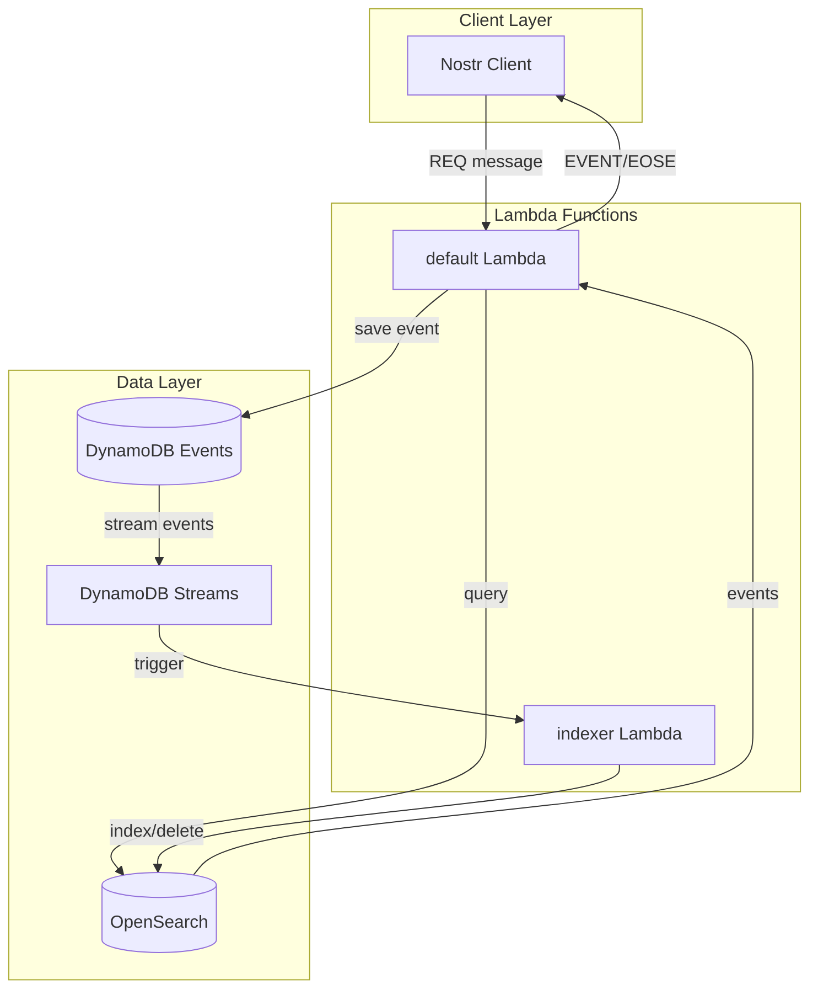
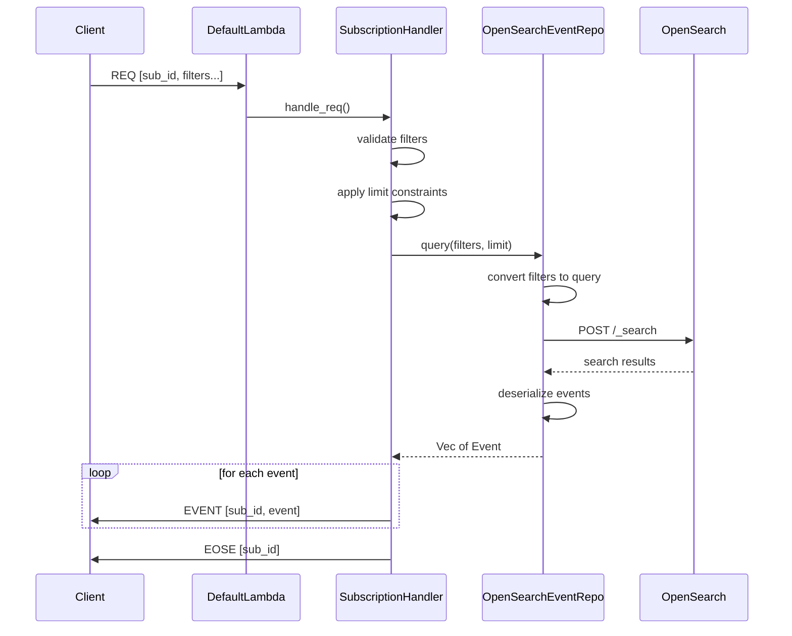
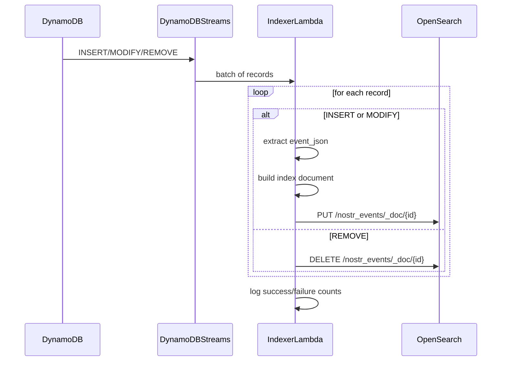
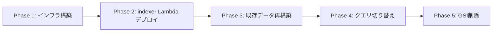

# Technical Design: OpenSearch REQ Processing

## Overview

**Purpose**: この機能は、OpenSearch Serviceを使用したREQ（サブスクリプション）メッセージ処理の実装を提供する。現在のDynamoDBテーブルスキャンベースのクエリを、OpenSearchによる効率的なインデックスベースのクエリに置き換えることで、REQ処理のパフォーマンスとスケーラビリティを大幅に向上させる。

**Users**: Nostrクライアントユーザーがサブスクリプションを作成する際に、より高速なイベント検索結果を得られる。運用者はOpenSearch経由の検索パフォーマンスを監視できる。

**Impact**: 現在のEventRepositoryのquery処理をOpenSearch実装に置き換え、DynamoDB Streamsを介してリアルタイムでイベントを同期する新しいデータパイプラインを構築する。

### Goals

- NIP-01フィルター条件（ids、authors、kinds、#タグ、since、until、limit）をOpenSearchクエリに正確に変換する
- DynamoDB Streamsを使用してイベントデータをOpenSearchにリアルタイム同期する
- 既存のEventRepositoryインターフェースとの互換性を維持する
- t3.small.search（無料枠対象）を使用したコスト効率の良いインフラ構成を実現する

### Non-Goals

- OpenSearch Serverlessの使用（コスト最適化のためマネージド版を採用）
- 全文検索機能の実装（NIP-50は対象外）
- OpenSearch障害時のDynamoDBフォールバック機能
- マルチノードクラスタ構成（シングルノードで開始）

## Architecture

### Existing Architecture Analysis

現在のシステムは以下の構成を持つ:
- **EventRepository trait**: `query()`メソッドでフィルターに基づくイベント検索を抽象化
- **DynamoEventRepository**: テーブルスキャン + アプリ層フィルタリングでクエリを実行
- **SubscriptionHandler**: EventRepositoryを使用してREQメッセージを処理
- **DynamoDB GSI**: GSI-PkKind、GSI-PkKindD（書き込み処理用）、GSI-PubkeyCreatedAt、GSI-KindCreatedAt（未使用）

問題点:
- テーブルスキャンはデータ量増加に伴いパフォーマンスが劣化
- フィルタリングがアプリ層で行われるため非効率
- GSI-PubkeyCreatedAtとGSI-KindCreatedAtは使用されていない

### Architecture Pattern & Boundary Map



**Architecture Integration**:
- **Selected pattern**: Event Sourcing with Materialized View - DynamoDBを真実の源として維持し、OpenSearchを検索用マテリアライズドビューとして使用
- **Domain/feature boundaries**: インフラ層にOpenSearchEventRepositoryを追加し、既存のEventRepositoryトレイトを維持
- **Existing patterns preserved**: Repository Pattern、レイヤードアーキテクチャ、Lambda関数パターン
- **New components rationale**: indexer Lambda（ストリーム処理）、OpenSearchEventRepository（検索クエリ）、FilterToQueryConverter（フィルター変換）
- **Steering compliance**: 3層アーキテクチャ（Domain/Application/Infrastructure）を維持、ARM64 Lambdaを使用

### Technology Stack

| Layer | Choice / Version | Role in Feature | Notes |
|-------|------------------|-----------------|-------|
| Backend / Services | opensearch = "2.3" + aws-auth feature | OpenSearchクライアント、AWS SigV4認証 | aws-configと連携 |
| Data / Storage | AWS OpenSearch Service | イベント検索インデックス | t3.small.search（無料枠） |
| Messaging / Events | DynamoDB Streams | イベント変更通知 | NEW_AND_OLD_IMAGES |
| Infrastructure / Runtime | Lambda (provided.al2023, ARM64) | indexer Lambda実行 | 既存パターンに準拠 |

## System Flows

### REQ Processing Flow



### DynamoDB Streams Indexing Flow



**Key Decisions**:
- バッチ処理でストリームレコードを効率的に処理
- INSERTとMODIFYは同一処理（PUT = upsert動作）
- エラー時はLambdaリトライメカニズムに依存

## Requirements Traceability

| Requirement | Summary | Components | Interfaces | Flows |
|-------------|---------|------------|------------|-------|
| 1.1-1.9 | OpenSearch Serviceインフラ | Terraform opensearch.tf | - | - |
| 2.1-2.9 | イベントインデックス構造 | OpenSearch index template | - | - |
| 3.1-3.7 | DynamoDB Streams同期 | IndexerLambda | DynamoDB Stream trigger | Indexing Flow |
| 4.1-4.8 | フィルター変換 | FilterToQueryConverter | - | REQ Flow |
| 5.1-5.8 | クエリ実行 | OpenSearchEventRepository | QueryRepository trait | REQ Flow |
| 6.1-6.5 | 接続管理 | OpenSearchConfig | - | - |
| 7.1-7.5 | エラーハンドリング | SubscriptionHandler, OpenSearchEventRepository | - | REQ Flow |
| 8.1-8.4 | モニタリング | 構造化ログ | tracing | Both flows |
| 9.1-9.5 | 既存互換性 | QueryRepository trait, EventRepository継承 | QueryRepository trait | REQ Flow |
| 10.1-10.6 | インデックス再構築 | rebuild script | - | - |
| 11.1-11.5 | GSI削除 | Terraform dynamodb.tf | - | - |

## Components and Interfaces

| Component | Domain/Layer | Intent | Req Coverage | Key Dependencies | Contracts |
|-----------|--------------|--------|--------------|------------------|-----------|
| QueryRepository trait | Domain | クエリ専用のリポジトリトレイト（EventRepositoryのサブセット） | 5.1-5.8, 9.1-9.5 | nostr::Filter | Service |
| FilterToQueryConverter | Infrastructure | NIP-01フィルターをOpenSearchクエリに変換（OpenSearchEventRepository内部実装） | 4.1-4.8 | nostr::Filter | Service |
| OpenSearchEventRepository | Infrastructure | OpenSearchを使用したQueryRepository実装 | 5.1-5.8, 6.1-6.5, 7.1-7.5 | opensearch, FilterToQueryConverter (P0) | Service |
| IndexerLambda | Infrastructure | DynamoDB StreamsからOpenSearchへのインデックス処理 | 3.1-3.7, 8.1-8.4 | opensearch, DynamoDB Streams (P0) | Event |
| OpenSearchConfig | Infrastructure | OpenSearch接続設定 | 6.1-6.5 | aws-config (P0) | Service |
| Terraform opensearch.tf | Infrastructure | OpenSearch Serviceドメイン定義 | 1.1-1.9 | aws provider (P0) | - |

### Domain Layer

#### QueryRepository trait

| Field | Detail |
|-------|--------|
| Intent | クエリ専用のリポジトリトレイト。EventRepositoryからquery()メソッドのみを分離し、検索専用リポジトリの抽象化を提供する |
| Requirements | 5.1, 5.2, 5.3, 5.4, 5.5, 5.6, 5.7, 5.8, 9.1, 9.2, 9.3, 9.4, 9.5 |

**Responsibilities & Constraints**
- フィルター条件に基づくイベント検索のみを責務とする
- save()やget_by_id()は含まない（書き込みは別のリポジトリが担当）
- 既存のEventRepositoryとの互換性を考慮した設計

**Dependencies**
- Inbound: SubscriptionHandler - REQクエリ処理 (P0)
- External: nostr::Filter - フィルター型定義 (P0)
- External: nostr::Event - イベント型定義 (P0)

**Contracts**: Service [x] / API [ ] / Event [ ] / Batch [ ] / State [ ]

##### Service Interface

```rust
use async_trait::async_trait;
use nostr::{Event, Filter};

/// クエリ専用リポジトリトレイト
/// EventRepositoryのサブセットとして、検索操作のみを抽象化
#[async_trait]
pub trait QueryRepository: Send + Sync {
    /// フィルターに合致するイベントをクエリ
    ///
    /// # Arguments
    /// * `filters` - 検索条件のフィルター配列（OR結合）
    /// * `limit` - 取得する最大イベント数
    ///
    /// # Returns
    /// * `Ok(Vec<Event>)` - created_at降順でソートされたイベント
    /// * `Err(QueryRepositoryError)` - クエリ実行エラー
    async fn query(
        &self,
        filters: &[Filter],
        limit: Option<u32>,
    ) -> Result<Vec<Event>, QueryRepositoryError>;
}

/// QueryRepository固有のエラー型
#[derive(Debug, Error)]
pub enum QueryRepositoryError {
    #[error("Query execution error: {0}")]
    QueryError(String),

    #[error("Connection error: {0}")]
    ConnectionError(String),

    #[error("Deserialization error: {0}")]
    DeserializationError(String),
}

/// EventRepositoryはQueryRepositoryを継承
/// 既存コードとの互換性を維持
#[async_trait]
pub trait EventRepository: QueryRepository {
    async fn save(&self, event: &Event) -> Result<SaveResult, EventRepositoryError>;
    async fn get_by_id(&self, event_id: &str) -> Result<Option<Event>, EventRepositoryError>;
}
```

- Preconditions: フィルターはFilterEvaluator::validate_filterで検証済み
- Postconditions: フィルターに合致するイベントをcreated_at降順で返す
- Invariants: 空のフィルター配列は全イベントを対象とする

**Implementation Notes**
- Integration: 既存のEventRepositoryトレイトはQueryRepositoryを継承する形に変更（DynamoEventRepositoryは両方を実装）
- Validation: SubscriptionHandlerでフィルター検証済みのため、トレイト内での再検証は不要
- Risks: 既存コードの変更が必要だが、トレイト継承により影響を最小化

### Infrastructure Layer

#### FilterToQueryConverter

| Field | Detail |
|-------|--------|
| Intent | NIP-01フィルター条件をOpenSearch Query DSLに変換する（OpenSearchEventRepositoryの内部実装） |
| Requirements | 4.1, 4.2, 4.3, 4.4, 4.5, 4.6, 4.7, 4.8 |

**Responsibilities & Constraints**
- Filter構造体からOpenSearch bool queryを生成
- 複数フィルター条件はANDで結合
- 複数フィルターオブジェクトはORで結合
- ids/authorsは完全一致検索（terms query）のみサポート（注: nostrクレートの制約により前方一致は非サポート）
- OpenSearch固有のQuery DSL生成ロジックをカプセル化

**Dependencies**
- Inbound: OpenSearchEventRepository - フィルター変換 (P0)
- External: nostr::Filter - フィルター型定義 (P0)

**Contracts**: Service [x] / API [ ] / Event [ ] / Batch [ ] / State [ ]

##### Service Interface

```rust
/// フィルターからOpenSearchクエリへの変換
/// OpenSearchEventRepositoryモジュール内のプライベート実装
pub(super) struct FilterToQueryConverter;

impl FilterToQueryConverter {
    /// 複数フィルターをOpenSearchクエリJSONに変換
    /// フィルターが空の場合はmatch_allクエリを返す
    pub fn convert(filters: &[Filter]) -> serde_json::Value;

    /// 単一フィルターをbool query clauseに変換
    fn convert_single_filter(filter: &Filter) -> serde_json::Value;

    /// idsフィルターをterms queryに変換（完全一致のみ）
    /// 注: nostrクレートの制約により前方一致は非サポート
    fn build_ids_query(ids: &BTreeSet<EventId>) -> Option<serde_json::Value>;

    /// authorsフィルターをterms queryに変換（完全一致のみ）
    /// 注: nostrクレートの制約により前方一致は非サポート
    fn build_authors_query(authors: &BTreeSet<PublicKey>) -> Option<serde_json::Value>;

    /// kindsフィルターをterms queryに変換
    fn build_kinds_query(kinds: &HashSet<Kind>) -> serde_json::Value;

    /// since/untilをrange queryに変換
    fn build_time_range_query(since: Option<Timestamp>, until: Option<Timestamp>) -> Option<serde_json::Value>;

    /// タグフィルターをterms queryに変換
    fn build_tag_query(tag_name: &str, values: &[String]) -> serde_json::Value;
}
```

- Preconditions: フィルターはFilterEvaluator::validate_filterで検証済み
- Postconditions: 有効なOpenSearch Query DSL JSONを返す
- Invariants: 空のフィルター配列はmatch_allクエリを生成

**Implementation Notes**
- Integration: nostr crateのFilter型を直接使用、OpenSearchEventRepositoryモジュール内に配置
- Validation: フィルター検証は呼び出し元（SubscriptionHandler）で実施済み
- Risks: OpenSearchクエリ構文エラーの可能性（unit testで網羅）
- Visibility: `pub(super)`として、opensearchモジュール外からは直接アクセス不可

#### OpenSearchEventRepository

| Field | Detail |
|-------|--------|
| Intent | OpenSearchを使用してQueryRepositoryトレイトを実装する（クエリ専用） |
| Requirements | 5.1, 5.2, 5.3, 5.4, 5.5, 5.6, 5.7, 5.8, 6.1, 6.2, 6.3, 6.4, 6.5, 7.1, 7.2, 7.3, 7.4, 7.5 |

**Responsibilities & Constraints**
- QueryRepositoryトレイトのquery()メソッドを実装
- OpenSearch Query DSLを使用してイベントを検索
- created_at降順でソート
- event_jsonフィールドからNostr Eventをデシリアライズ
- save/get_by_idは責務外（DynamoEventRepositoryが担当）

**Dependencies**
- Inbound: SubscriptionHandler - REQクエリ処理 (P0)
- Internal: FilterToQueryConverter - フィルター変換 (P0)
- External: opensearch crate - OpenSearchクライアント (P0)
- External: aws-config - AWS認証 (P0)

**Contracts**: Service [x] / API [ ] / Event [ ] / Batch [ ] / State [ ]

##### Service Interface

```rust
/// OpenSearchを使用したQueryRepository実装
/// クエリ専用のため、save/get_by_idは実装しない
pub struct OpenSearchEventRepository {
    client: OpenSearch,
    index_name: String,
}

impl OpenSearchEventRepository {
    /// 新しいOpenSearchEventRepositoryを作成
    pub async fn new(config: &OpenSearchConfig) -> Result<Self, OpenSearchEventRepositoryError>;
}

#[async_trait]
impl QueryRepository for OpenSearchEventRepository {
    /// OpenSearchを使用してフィルターに合致するイベントをクエリ
    ///
    /// # Arguments
    /// * `filters` - 検索条件のフィルター配列（OR結合）
    /// * `limit` - 取得する最大イベント数
    ///
    /// # Returns
    /// * `Ok(Vec<Event>)` - created_at降順でソートされたイベント
    /// * `Err(QueryRepositoryError)` - クエリ実行エラー
    async fn query(
        &self,
        filters: &[Filter],
        limit: Option<u32>,
    ) -> Result<Vec<Event>, QueryRepositoryError>;
}

/// OpenSearchEventRepository固有のエラー型
#[derive(Debug, Error)]
pub enum OpenSearchEventRepositoryError {
    #[error("Connection error: {0}")]
    ConnectionError(String),

    #[error("Query error: {0}")]
    QueryError(String),

    #[error("Serialization error: {0}")]
    SerializationError(String),

    #[error("Index not found")]
    IndexNotFound,
}

impl From<OpenSearchEventRepositoryError> for QueryRepositoryError {
    fn from(err: OpenSearchEventRepositoryError) -> Self {
        match err {
            OpenSearchEventRepositoryError::ConnectionError(msg) => QueryRepositoryError::ConnectionError(msg),
            OpenSearchEventRepositoryError::QueryError(msg) => QueryRepositoryError::QueryError(msg),
            OpenSearchEventRepositoryError::SerializationError(msg) => QueryRepositoryError::DeserializationError(msg),
            OpenSearchEventRepositoryError::IndexNotFound => QueryRepositoryError::QueryError("Index not found".to_string()),
        }
    }
}
```

- Preconditions: OpenSearchドメインが利用可能、IAM権限が設定済み
- Postconditions: フィルターに合致するイベントをcreated_at降順で返す
- Invariants: event_jsonフィールドから完全なEvent構造体をデシリアライズ

**Implementation Notes**
- Integration: QueryRepositoryのみを実装。SubscriptionHandlerはQueryRepository型で依存注入を受ける
- Validation: インデックス不在時はエラーを返す（システム構成問題として扱う）
- Risks: OpenSearch接続エラー時のタイムアウト処理が必要

#### OpenSearchConfig

| Field | Detail |
|-------|--------|
| Intent | OpenSearch接続設定を環境変数から読み取る |
| Requirements | 6.4 |

**Responsibilities & Constraints**
- OPENSEARCH_ENDPOINT環境変数からエンドポイントURLを読み取る
- AWS認証情報をaws-configから取得

**Dependencies**
- External: aws-config - AWS認証情報 (P0)

**Contracts**: Service [x] / API [ ] / Event [ ] / Batch [ ] / State [ ]

##### Service Interface

```rust
/// OpenSearch接続設定
pub struct OpenSearchConfig {
    pub endpoint: String,
    pub index_name: String,
}

impl OpenSearchConfig {
    /// 環境変数から設定を読み取る
    /// OPENSEARCH_ENDPOINT: OpenSearchドメインエンドポイントURL
    /// OPENSEARCH_INDEX: インデックス名（デフォルト: nostr_events）
    pub fn from_env() -> Result<Self, OpenSearchConfigError>;
}

#[derive(Debug, Error)]
pub enum OpenSearchConfigError {
    #[error("Missing environment variable: {0}")]
    MissingEnvVar(String),

    #[error("Invalid endpoint URL: {0}")]
    InvalidEndpoint(String),
}
```

#### IndexerLambda

| Field | Detail |
|-------|--------|
| Intent | DynamoDB StreamsイベントをOpenSearchにインデックス化する |
| Requirements | 3.1, 3.2, 3.3, 3.4, 3.5, 3.6, 3.7, 8.1, 8.4 |

**Responsibilities & Constraints**
- DynamoDB Streamsからのイベントをバッチ処理
- INSERT/MODIFYイベントをOpenSearchにインデックス
- REMOVEイベントでOpenSearchドキュメントを削除
- 処理結果を構造化ログに記録

**Dependencies**
- External: DynamoDB Streams - イベントソース (P0)
- External: opensearch crate - OpenSearchクライアント (P0)
- External: lambda_runtime - Lambda実行環境 (P0)

**Contracts**: Service [ ] / API [ ] / Event [x] / Batch [ ] / State [ ]

##### Event Contract

- **Subscribed events**: DynamoDB Streams (NEW_AND_OLD_IMAGES)
  - INSERT: 新規イベント追加
  - MODIFY: イベント更新（Replaceable/Addressableイベントの置換）
  - REMOVE: イベント削除
- **Ordering / delivery guarantees**: シャード内順序保証、at-least-once配信
- **Idempotency**: イベントIDをドキュメントIDとして使用（PUT = upsert）

##### インデックスドキュメント構造

```json
{
  "id": "event_id_hex",
  "pubkey": "pubkey_hex",
  "kind": 1,
  "created_at": 1700000000,
  "tag_e": ["referenced_event_id"],
  "tag_p": ["referenced_pubkey"],
  "tag_d": "identifier",
  "event_json": "{...完全なイベントJSON...}"
}
```

**Implementation Notes**
- Integration: バッチサイズ設定（Terraform: batch_size = 100）
- Validation: event_json欠損時はスキップしてログ記録
- Risks: 大量の同時ストリームイベント時の処理遅延

### Terraform Infrastructure

#### opensearch.tf (新規ファイル)

| Field | Detail |
|-------|--------|
| Intent | OpenSearch Serviceドメインとアクセスポリシーを定義 |
| Requirements | 1.1, 1.2, 1.3, 1.4, 1.5, 1.6, 1.7, 1.8, 1.9 |

**リソース定義**

```hcl
# OpenSearch Serviceドメイン
resource "aws_opensearch_domain" "nostr_relay" {
  domain_name    = "nostr-relay"
  engine_version = "OpenSearch_2.11"

  cluster_config {
    instance_type  = "t3.small.search"
    instance_count = 1
  }

  ebs_options {
    ebs_enabled = true
    volume_type = "gp3"
    volume_size = 10
  }

  encrypt_at_rest {
    enabled = true
  }

  node_to_node_encryption {
    enabled = true
  }

  domain_endpoint_options {
    enforce_https       = true
    tls_security_policy = "Policy-Min-TLS-1-2-2019-07"
  }

  access_policies = jsonencode({
    Version = "2012-10-17"
    Statement = [{
      Effect    = "Allow"
      Principal = { AWS = aws_iam_role.lambda_exec.arn }
      Action    = "es:*"
      Resource  = "arn:aws:es:${data.aws_region.current.name}:${data.aws_caller_identity.current.account_id}:domain/nostr-relay/*"
    }]
  })
}
```

**Lambda環境変数追加**

```hcl
# default Lambda
environment {
  variables = {
    OPENSEARCH_ENDPOINT = aws_opensearch_domain.nostr_relay.endpoint
    OPENSEARCH_INDEX    = "nostr_events"
    # 既存の環境変数...
  }
}

# indexer Lambda (新規)
resource "aws_lambda_function" "indexer" {
  function_name = "nostr_relay_indexer"
  # ...
  environment {
    variables = {
      OPENSEARCH_ENDPOINT = aws_opensearch_domain.nostr_relay.endpoint
      OPENSEARCH_INDEX    = "nostr_events"
    }
  }
}

# DynamoDB Streams event source mapping
resource "aws_lambda_event_source_mapping" "indexer" {
  event_source_arn  = aws_dynamodb_table.events.stream_arn
  function_name     = aws_lambda_function.indexer.arn
  starting_position = "LATEST"
  batch_size        = 100
}
```

## Data Models

### Domain Model

本機能ではドメインモデルの変更なし。既存のNostr Event構造体（nostr crateから提供）を継続使用。

### Physical Data Model

#### OpenSearch Index Mapping

```json
{
  "mappings": {
    "properties": {
      "id": { "type": "keyword" },
      "pubkey": { "type": "keyword" },
      "kind": { "type": "integer" },
      "created_at": { "type": "long" },
      "tag_e": { "type": "keyword" },
      "tag_p": { "type": "keyword" },
      "tag_d": { "type": "keyword" },
      "tag_a": { "type": "keyword" },
      "tag_t": { "type": "keyword" },
      "event_json": {
        "type": "text",
        "index": false
      }
    }
  },
  "settings": {
    "number_of_shards": 1,
    "number_of_replicas": 0
  }
}
```

**設計決定**:
- `id`をドキュメントIDとして使用（重複防止）
- `event_json`はindex: falseで検索対象外（ストレージ最適化）
- シングルシャード/レプリカなし（t3.small.search向け最適化）
- 英字1文字タグは`tag_{letter}`フィールドとして個別インデックス

#### DynamoDB Eventsテーブル変更

```hcl
# DynamoDB Streams有効化
resource "aws_dynamodb_table" "events" {
  # 既存設定...

  stream_enabled   = true
  stream_view_type = "NEW_AND_OLD_IMAGES"
}
```

### Data Contracts & Integration

#### OpenSearch Query Request

```json
{
  "query": {
    "bool": {
      "should": [
        {
          "bool": {
            "must": [
              { "terms": { "kind": [1, 6] } },
              { "range": { "created_at": { "gte": 1700000000 } } }
            ]
          }
        }
      ]
    }
  },
  "sort": [
    { "created_at": "desc" },
    { "id": "asc" }
  ],
  "size": 100,
  "_source": ["event_json"]
}
```

#### OpenSearch Query Response

```json
{
  "hits": {
    "total": { "value": 50 },
    "hits": [
      {
        "_id": "abc123...",
        "_source": {
          "event_json": "{\"id\":\"abc123...\",\"pubkey\":\"...\",\"kind\":1,...}"
        }
      }
    ]
  }
}
```

## Error Handling

### Error Strategy

- **Fail Fast**: フィルター検証、設定読み取りエラーは即時失敗
- **Graceful Degradation**: OpenSearch一時障害時はCLOSEDメッセージで通知
- **Observability**: 全エラーを構造化ログに記録

### Error Categories and Responses

**System Errors (OpenSearch障害)**:
- タイムアウト: CLOSED with "error: query timeout"
- 一時的利用不能: CLOSED with "error: service temporarily unavailable"
- インデックス不存在: CLOSED with "error: index not found"（システム構成エラー）

**Connection Errors**:
- 接続失敗: エラーログ記録、Lambda再試行
- 認証失敗: エラーログ記録（IAM設定確認必要）

### Monitoring

- CloudWatch Logs: 構造化ログ（JSON形式）
- OpenSearch CloudWatch Metrics: クラスタヘルス、レイテンシ
- カスタムログフィールド: query_duration_ms, result_count, filter_count

## Testing Strategy

### Unit Tests

- FilterToQueryConverter: 各フィルター条件の変換ロジック
- OpenSearchEventRepository: クエリ構築とレスポンスパース
- OpenSearchConfig: 環境変数読み取りとバリデーション
- IndexerLambda: ストリームレコードからドキュメント構築

### Integration Tests

- OpenSearch接続テスト（ローカルOpenSearchコンテナ使用）
- DynamoDB Streams -> indexer Lambda -> OpenSearch フロー
- REQ -> OpenSearch query -> EVENT/EOSE フロー
- インデックス作成/削除操作

### E2E Tests

- Nostrクライアントからの実REQメッセージ処理
- イベント保存後のOpenSearchインデックス反映確認
- 複数フィルター条件の組み合わせテスト

## Optional Sections

### Security Considerations

- **IAM認証**: OpenSearchアクセスにAWS SigV4署名を使用
- **アクセスポリシー**: Lambda実行ロールのみがOpenSearchにアクセス可能
- **暗号化**: at-rest暗号化、node-to-node暗号化、HTTPS強制
- **ネットワーク**: パブリックアクセス + IAMポリシーによるアクセス制御

### Performance & Scalability

- **Target metrics**:
  - REQクエリ応答時間: < 500ms (p95)
  - インデックス遅延: < 3秒（DynamoDB Streams特性）
- **Scaling approach**:
  - 初期: t3.small.search シングルノード
  - 拡張: インスタンスタイプのスケールアップまたはノード追加
- **Optimization**:
  - _source: ["event_json"] で転送データ最小化
  - シングルシャードで小規模データセット最適化

### Migration Strategy



**Phase 1: インフラ構築**
- OpenSearch Serviceドメイン作成
- IAMポリシー設定
- インデックステンプレート適用

**Phase 2: indexer Lambda デプロイ**
- DynamoDB Streams有効化
- indexer Lambda関数デプロイ
- イベントソースマッピング設定

**Phase 3: 既存データ再構築**
- rebuild scriptでDynamoDB全イベントをスキャン
- バルクインデックスでOpenSearchに投入
- 整合性確認

**Phase 4: クエリ切り替え**
- default LambdaにOpenSearchEventRepository追加
- query()呼び出しをOpenSearch実装に切り替え
- パフォーマンス監視

**Phase 5: GSI削除（OpenSearch安定稼働確認後）**
- GSI-PubkeyCreatedAt削除
- GSI-KindCreatedAt削除

**Rollback trigger**: Phase 4でエラー率上昇時はDynamoEventRepositoryに切り戻し

## Supporting References

### opensearch crate使用例

```rust
use opensearch::{OpenSearch, SearchParts};
use opensearch::http::transport::{SingleNodeConnectionPool, TransportBuilder};
use url::Url;

// AWS SigV4認証付きクライアント作成
let url = Url::parse(&config.endpoint)?;
let conn_pool = SingleNodeConnectionPool::new(url);
let aws_config = aws_config::from_env().load().await;
let transport = TransportBuilder::new(conn_pool)
    .auth(aws_config.try_into()?)
    .service_name("es")
    .build()?;
let client = OpenSearch::new(transport);

// 検索クエリ実行
let response = client
    .search(SearchParts::Index(&[&config.index_name]))
    .body(query_json)
    .send()
    .await?;
```

### Cargo.toml追加依存関係

```toml
# OpenSearchクライアント with AWS認証
opensearch = { version = "2.3", features = ["aws-auth"] }

# URL解析
url = "2"
```
