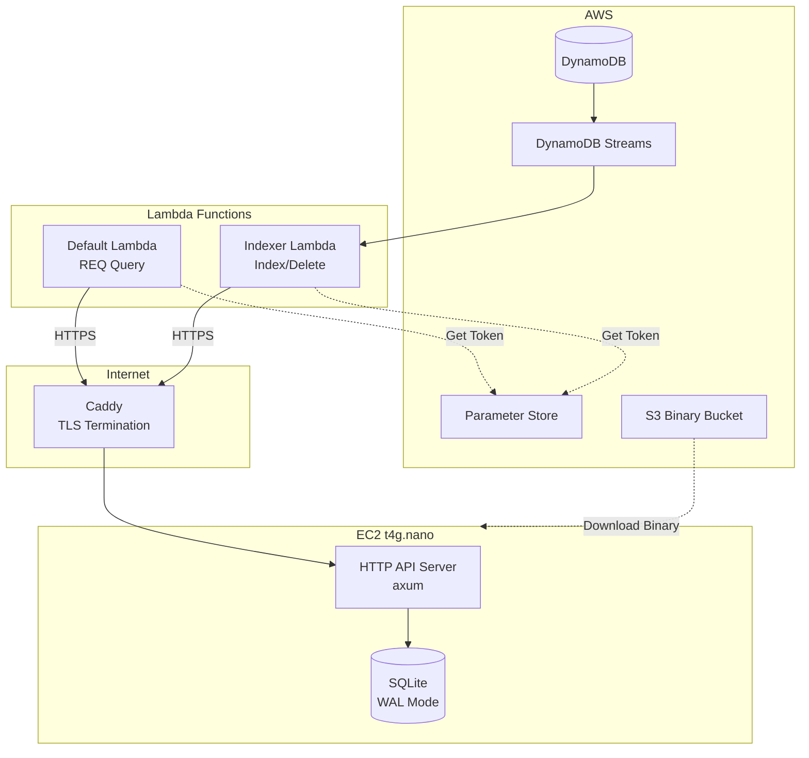
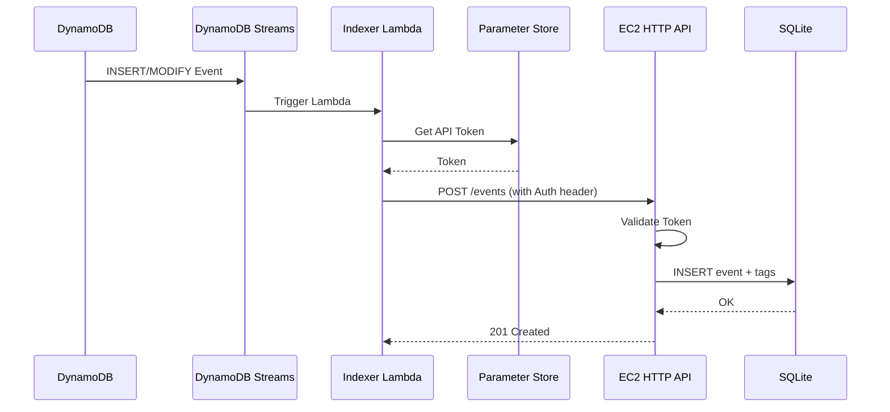
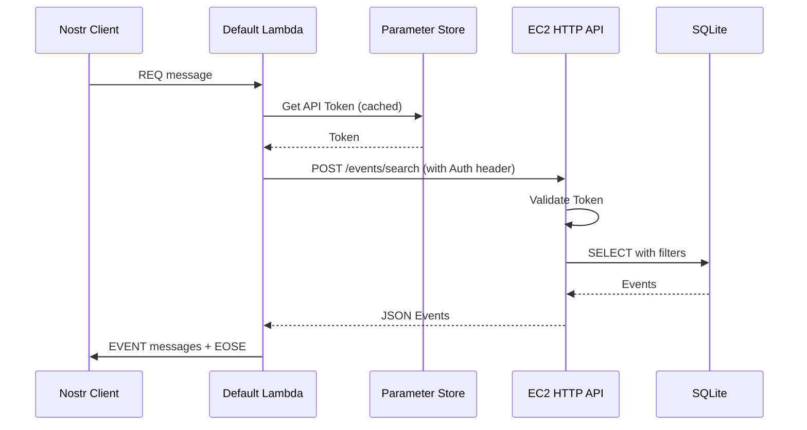
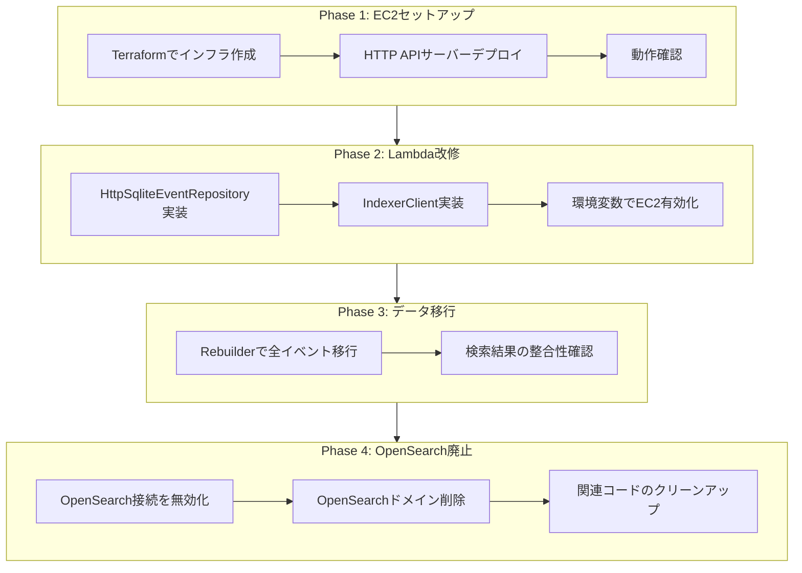

# Design Document: 検索基盤のEC2 + SQLite移行

## Overview

**Purpose**: 本機能は、月額約6,000円のOpenSearch ServiceコストをEC2 t4g.nano + SQLite構成により約570円に削減する。Nostrリレーの検索機能（REQフィルタ処理）を維持しながら、持続可能な運用コストを実現する。

**Users**: システム運用者（インフラ構築・監視）、Lambda関数（検索API呼び出し）、復元ツール実行者（データ移行時）が本機能を利用する。

**Impact**: 現在のOpenSearch Service依存を排除し、EC2上のHTTP APIサーバーとSQLiteデータベースに置き換える。Lambda関数の検索ロジック、Indexer Lambda、Terraform設定に変更が発生する。

### Goals

- OpenSearchと同等のREQフィルタ処理機能をSQLiteで実現
- 月額コスト1,000円以下（目標: 約570円）を達成
- Lambda関数からの安全なHTTPSアクセスを確保
- DynamoDBからのインデックス再構築機能を提供

### Non-Goals

- 高可用性構成（マルチAZ、Auto Scaling）は対象外
- 全文検索やファセット検索などの高度な検索機能
- リアルタイム性が求められる検索（ミリ秒オーダー）
- 既存のDynamoDB構成の変更

## Architecture

### Existing Architecture Analysis

現在のシステムはOpenSearch Serviceを検索エンジンとして使用し、DynamoDB Streamsを経由してIndexer Lambdaがイベントをインデックス化している。

変更対象:
- `OpenSearchEventRepository` -> `HttpSqliteEventRepository`に置き換え
- Indexer Lambda: OpenSearch API -> EC2 HTTP API
- Terraform: OpenSearch Service削除、EC2リソース追加

維持すべき境界:
- `QueryRepository`トレイト（検索インターフェース）
- DynamoDB Streams連携（イベントソースマッピング）
- Lambda関数のアーキテクチャパターン（3層構造）

### Architecture Pattern & Boundary Map



**Architecture Integration**:
- **Selected pattern**: シンプルな単一EC2構成（コスト最適化優先）
- **Domain boundaries**: EC2上のHTTP APIサーバーは検索・インデックス専用、DynamoDBが真実の源泉を維持
- **Existing patterns preserved**: QueryRepositoryトレイト、Lambda 3層アーキテクチャ、Terraform モジュールパターン
- **New components rationale**: Caddyはゼロ設定のTLS自動化、axumはtower互換のモダンHTTPフレームワーク
- **Steering compliance**: Rust Edition 2024、ARM64アーキテクチャ、構造化ログ (tracing) を継承
- **Network**: デフォルトVPCのパブリックサブネットを使用。既存リソース（Lambda、DynamoDB等）はすべてパブリックエンドポイントで動作しており、新規VPC作成による複雑さを避ける

### Technology Stack

| Layer | Choice / Version | Role in Feature | Notes |
|-------|------------------|-----------------|-------|
| HTTP Server | axum 0.8.x | EC2上のHTTP APIサーバー | tower互換、async-trait不要 |
| Database | SQLite 3.34+ (rusqlite) | イベント検索・保存 | WALモード、synchronous=NORMAL |
| Connection Pool | deadpool-sqlite | 読み取り用async接続プール | rusqlite互換、Tokio対応 |
| TLS Termination | Caddy 2.x | HTTPS終端、Let's Encrypt自動化 | ゼロ設定、HTTP-01チャレンジ |
| HTTP Client | reqwest + reqwest_retry | Lambda -> EC2通信 | 指数バックオフ再試行 |
| Infrastructure | Terraform | EC2, EBS, EIP, Route53 | 既存モジュールパターン継承 |

## System Flows

### イベントインデックス作成フロー



### REQクエリ処理フロー



**Key Decisions**:
- APIトークンはParameter Store (SecureString)で管理し、Lambda初期化時にキャッシュ
- EC2通信失敗時は指数バックオフで最大3回再試行
- WALモードにより読み書き並行処理を許可

## Requirements Traceability

| Requirement | Summary | Components | Interfaces | Flows |
|-------------|---------|------------|------------|-------|
| 1.1-1.9 | EC2インフラ構築 | TerraformEc2Module, UserDataScript | - | - |
| 2.1-2.11 | HTTP APIサーバー実装 | HttpApiServer, EventsHandler, SearchHandler | API Contract | Index Flow, Query Flow |
| 3.1-3.5 | セキュリティ対策 | AuthMiddleware | - | Auth in all flows |
| 4.1-4.2 | 可用性 | ElasticIP, Lambda Retry | Error handling | - |
| 5.1-5.6 | Lambda関数改修 | HttpSqliteEventRepository, IndexerClient | Service Interface | Both flows |
| 6.1-6.5 | インデックス復元 | RebuilderTool | Batch Contract | Rebuild flow |
| 7.1-7.4 | OpenSearch廃止 | Terraform cleanup | - | - |
| 8.1-8.4 | コスト目標 | t4g.nano + gp3 10GB | - | - |

## Components and Interfaces

| Component | Domain/Layer | Intent | Req Coverage | Key Dependencies | Contracts |
|-----------|--------------|--------|--------------|------------------|-----------|
| HttpApiServer | Infrastructure | EC2上のHTTP APIサーバー | 2.1-2.11, 3.1-3.5 | axum, rusqlite (P0) | API |
| SqliteEventStore | Infrastructure | SQLiteイベント管理 | 2.5-2.11 | rusqlite, deadpool-sqlite (P0) | Service |
| HttpSqliteEventRepository | Infrastructure | Lambda用クエリクライアント | 5.1-5.2 | reqwest (P0) | Service |
| IndexerClient | Infrastructure | Lambda用インデックスクライアント | 5.3-5.6 | reqwest, reqwest_retry (P0) | Service |
| RebuilderTool | Application | インデックス再構築ツール | 6.1-6.5 | DynamoDB, IndexerClient (P0) | Batch |
| TerraformEc2Module | Infrastructure | EC2インフラ定義 | 1.1-1.9 | aws provider (P0) | - |

### Infrastructure Layer

#### HttpApiServer

| Field | Detail |
|-------|--------|
| Intent | EC2上でHTTP APIを提供し、イベントの保存・検索・削除を処理する |
| Requirements | 2.1, 2.2, 2.3, 2.4, 2.5, 2.6, 2.7, 2.8, 2.9, 2.10, 2.11, 3.1, 3.2 |

**Responsibilities & Constraints**
- Caddyからのリクエストをlocalhost:8080で受信
- 認証ミドルウェアで全エンドポイント（/health除く）を保護
- SQLiteEventStoreを使用してデータ操作を実行

**Dependencies**
- Inbound: Caddy - TLS終端後のHTTPリクエスト転送 (P0)
- Outbound: SqliteEventStore - イベントデータ操作 (P0)

**Contracts**: API [ x ]

##### API Contract

| Method | Endpoint | Request | Response | Errors |
|--------|----------|---------|----------|--------|
| POST | /events | NostrEvent JSON | 201 Created / 200 OK | 400, 401, 500 |
| DELETE | /events/{id} | - | 204 No Content | 401, 404, 500 |
| POST | /events/search | Filter JSON | Event[] JSON | 400, 401, 500 |
| GET | /health | - | 200 OK | 500 |

**Request/Response Examples**:

```rust
// POST /events - リクエスト
{
  "id": "abc123...",
  "pubkey": "def456...",
  "kind": 1,
  "created_at": 1700000000,
  "content": "Hello",
  "tags": [["e", "xyz..."], ["p", "uvw..."]],
  "sig": "..."
}

// POST /events/search - リクエスト
{
  "ids": ["abc123..."],
  "authors": ["def456..."],
  "kinds": [1, 7],
  "since": 1700000000,
  "until": 1800000000,
  "limit": 100,
  "#e": ["xyz..."],
  "#p": ["uvw..."]
}

// POST /events/search - レスポンス
[
  { "id": "...", "pubkey": "...", ... }
]
```

**Implementation Notes**
- Integration: systemdサービスとして/var/lib/nostr/events.dbにアクセス
- Validation: NostrイベントのJSON構造を検証（署名検証は不要、DynamoDBで検証済み）
- Risks: SQLite同時書き込み制限（WALモードで緩和）

---

#### SqliteEventStore

| Field | Detail |
|-------|--------|
| Intent | SQLiteデータベースへのイベント保存・検索・削除を提供する |
| Requirements | 2.5, 2.6, 2.7, 2.8, 2.9, 2.10, 2.11 |

**Responsibilities & Constraints**
- eventsテーブルとevent_tagsテーブルを管理
- トランザクション単位でイベントとタグを原子的に操作
- フィルター条件をSQL WHERE句に変換
- 読み取り/書き込みで接続を分離し、並行読み取り性能を確保

**Dependencies**
- Inbound: HttpApiServer - CRUD操作リクエスト (P0)
- External: rusqlite - SQLiteバインディング (P0)
- External: deadpool-sqlite - 読み取り用async接続プール (P0)

**Contracts**: Service [ x ]

##### Service Interface

```rust
use deadpool_sqlite::Pool;
use rusqlite::Connection;
use std::sync::{Arc, Mutex};

/// SQLiteイベントストア
/// - 書き込み: 専用の単一接続（Arc<Mutex<Connection>>）
/// - 読み取り: deadpool-sqliteによるasync接続プール
pub struct SqliteEventStore {
    write_conn: Arc<Mutex<Connection>>,  // 書き込み専用（低頻度のため単一接続で十分）
    read_pool: Pool,                      // 読み取り用async接続プール
}

impl SqliteEventStore {
    /// 新しいSqliteEventStoreを作成
    pub async fn new(db_path: &str) -> Result<Self, StoreError>;

    /// イベントを保存（タグも含む）
    /// 書き込み専用接続を使用し、トランザクションで原子的に実行
    pub async fn save_event(&self, event: &NostrEvent) -> Result<SaveResult, StoreError>;

    /// イベントIDで削除
    /// 書き込み専用接続を使用
    pub async fn delete_event(&self, event_id: &str) -> Result<bool, StoreError>;

    /// フィルター条件でイベントを検索
    /// 読み取りプールから接続を取得し、並行実行可能
    pub async fn search_events(
        &self,
        filter: &SearchFilter,
        limit: Option<u32>
    ) -> Result<Vec<NostrEvent>, StoreError>;
}

/// 保存結果
pub enum SaveResult {
    Created,
    AlreadyExists,
}

/// ストアエラー
pub enum StoreError {
    DatabaseError(String),
    SerializationError(String),
    PoolError(String),
}
```

- Preconditions: データベースファイルが存在し、WALモードが有効
- Postconditions: トランザクション完了後、データは永続化される
- Invariants: event_tagsのevent_idは必ずeventsテーブルに存在する

**Connection Management**
```rust
impl SqliteEventStore {
    pub async fn new(db_path: &str) -> Result<Self, StoreError> {
        // 書き込み用: 単一接続
        let write_conn = Connection::open(db_path)?;
        write_conn.execute_batch("PRAGMA journal_mode=WAL; PRAGMA synchronous=NORMAL;")?;

        // 読み取り用: deadpool-sqliteプール（最大4接続）
        let cfg = deadpool_sqlite::Config::new(db_path);
        let read_pool = cfg.builder(deadpool_sqlite::Runtime::Tokio1)?
            .max_size(4)
            .build()?;

        Ok(Self {
            write_conn: Arc::new(Mutex::new(write_conn)),
            read_pool,
        })
    }

    pub async fn search_events(&self, filter: &SearchFilter, limit: Option<u32>) -> Result<Vec<NostrEvent>, StoreError> {
        let conn = self.read_pool.get().await?;  // async接続取得
        conn.interact(move |conn| {
            // rusqliteのConnectionで同期的にクエリ実行
            // deadpool-sqliteが内部でspawn_blockingを処理
        }).await?
    }

    pub async fn save_event(&self, event: &NostrEvent) -> Result<SaveResult, StoreError> {
        let conn = self.write_conn.clone();
        tokio::task::spawn_blocking(move || {
            let conn = conn.lock().unwrap();
            // トランザクションでINSERT実行
        }).await?
    }
}
```

**Implementation Notes**
- Integration: 書き込みは単一接続でシリアライズ、読み取りはプールで並行処理
- Validation: SQLインジェクション対策としてプリペアドステートメントを使用
- Risks: 大量タグのイベントでINSERTパフォーマンス低下
- Pool sizing: t4g.nano (512MB RAM) で最大4接続は安全なサイズ

---

#### HttpSqliteEventRepository

| Field | Detail |
|-------|--------|
| Intent | Lambda関数からEC2 HTTP APIへのクエリ操作を提供する |
| Requirements | 5.1, 5.2 |

**Responsibilities & Constraints**
- 既存のQueryRepositoryトレイトを実装
- EC2エンドポイントへのHTTPSリクエストを送信
- レスポンスをNostr Event形式にデシリアライズ

**Dependencies**
- Inbound: Default Lambda - REQクエリ処理 (P0)
- External: reqwest - HTTPクライアント (P0)
- External: Parameter Store - APIトークン取得 (P0)

**Contracts**: Service [ x ]

##### Service Interface

```rust
/// HttpSqliteEventRepository - QueryRepository実装
impl QueryRepository for HttpSqliteEventRepository {
    async fn query(
        &self,
        filters: &[Filter],
        limit: Option<u32>,
    ) -> Result<Vec<Event>, QueryRepositoryError>;
}

/// 設定
pub struct HttpSqliteConfig {
    pub endpoint: String,      // e.g., "https://xxx.relay.nostr.nisshiee.org"
    pub api_token: String,     // Parameter Storeから取得
}
```

- Preconditions: endpoint URLが有効、api_tokenが設定済み
- Postconditions: 成功時はNostr Event配列を返却
- Invariants: TLS接続のみ許可

**Implementation Notes**
- Integration: OnceCell<HttpSqliteEventRepository>でLambda warm start時に再利用
- Risks: EC2停止時の接続エラー

---

#### IndexerClient

| Field | Detail |
|-------|--------|
| Intent | Indexer LambdaからEC2 HTTP APIへのインデックス操作を提供する |
| Requirements | 5.3, 5.4, 5.5, 5.6 |

**Responsibilities & Constraints**
- POST /eventsでイベントをインデックス化
- DELETE /events/{id}でイベントを削除
- 失敗時は指数バックオフで再試行

**Dependencies**
- Inbound: Indexer Lambda - DynamoDB Streamsイベント処理 (P0)
- External: reqwest - HTTPクライアント (P0)
- External: reqwest_retry - 再試行ミドルウェア (P0)
- External: Parameter Store - APIトークン取得 (P0)

**Contracts**: Service [ x ]

##### Service Interface

```rust
/// EC2 HTTP APIクライアント
pub struct IndexerClient {
    client: ClientWithMiddleware,
    endpoint: String,
    api_token: String,
}

impl IndexerClient {
    /// イベントをインデックス化
    pub async fn index_event(&self, event: &NostrEvent) -> Result<(), IndexerError>;

    /// イベントを削除
    pub async fn delete_event(&self, event_id: &str) -> Result<(), IndexerError>;
}

/// インデクサーエラー
pub enum IndexerError {
    HttpError { status: u16, message: String },
    NetworkError(String),
    RetryExhausted(String),
}
```

- Preconditions: APIトークンが有効
- Postconditions: 成功時はEC2側でデータが永続化される
- Invariants: 最大3回の再試行後も失敗した場合はエラーを返却

**Implementation Notes**
- Integration: ExponentialBackoff::builder().build_with_max_retries(3)を使用
- Validation: HTTPステータスコードで成功/失敗を判定
- Risks: EC2長時間停止時の再試行失敗

---

### Application Layer

#### RebuilderTool

| Field | Detail |
|-------|--------|
| Intent | DynamoDBからSQLiteインデックスを再構築する |
| Requirements | 6.1, 6.2, 6.3, 6.4, 6.5 |

**Responsibilities & Constraints**
- DynamoDBからイベントをスキャンして取得
- バッチ単位でEC2 HTTP APIにPOST
- 進捗をログに記録

**Dependencies**
- Outbound: DynamoDB - イベントソース (P0)
- Outbound: IndexerClient - EC2へのインデックス登録 (P0)

**Contracts**: Batch [ x ]

##### Batch / Job Contract

- Trigger: 手動実行（Lambda手動起動またはローカルCLI）
- Input / validation: 引数なし（全イベント対象）
- Output / destination: SQLiteデータベースへの一括登録
- Idempotency & recovery:
  - 既存イベントはスキップ（409 Conflictを無視）
  - 失敗時は中断位置からの再開が可能（LastEvaluatedKeyをログ出力）

**Implementation Notes**
- Integration: 既存のrebuilder.rsを改修、Indexerと同じHTTPクライアントを使用
- Validation: バッチサイズ（例: 100件）で進捗ログを出力

## Data Models

### Domain Model

本機能ではNostrイベントをそのまま保存する。ドメインモデルは既存のnostrクレートの型を使用。

- **Event**: id, pubkey, kind, created_at, content, tags, sig
- **Tag**: 配列形式 [tag_name, value, ...optional values]

検索対象のタグ:
- `#e`: イベント参照
- `#p`: 公開鍵参照
- `#d`: Addressable識別子
- `#a`: Addressableイベント参照
- `#t`: ハッシュタグ

### Physical Data Model

#### SQLite Schema

```sql
-- イベントテーブル
CREATE TABLE events (
    id TEXT PRIMARY KEY,           -- 64文字hex (イベントID)
    pubkey TEXT NOT NULL,          -- 64文字hex (公開鍵)
    kind INTEGER NOT NULL,         -- イベント種別
    created_at INTEGER NOT NULL,   -- UNIXタイムスタンプ
    event_json TEXT NOT NULL       -- 完全なイベントJSON
);

-- タグテーブル（正規化）
CREATE TABLE event_tags (
    event_id TEXT NOT NULL,        -- eventsテーブルへのFK
    tag_name TEXT NOT NULL,        -- タグ名 ('e', 'p', 'd', 'a', 't')
    tag_value TEXT NOT NULL,       -- タグ値
    FOREIGN KEY (event_id) REFERENCES events(id) ON DELETE CASCADE
);

-- インデックス定義
CREATE INDEX idx_events_pubkey ON events(pubkey);
CREATE INDEX idx_events_kind ON events(kind);
CREATE INDEX idx_events_created_at ON events(created_at DESC);
CREATE INDEX idx_events_pubkey_kind ON events(pubkey, kind);
CREATE INDEX idx_event_tags_name_value ON event_tags(tag_name, tag_value);
CREATE INDEX idx_event_tags_event_id ON event_tags(event_id);
```

**Design Decisions**:
- `event_json`に完全なJSONを保存し、検索後のデシリアライズを簡素化
- タグは正規化して別テーブルに保存し、柔軟なタグ検索を実現
- `ON DELETE CASCADE`でイベント削除時にタグも自動削除

**WAL Mode Configuration**:
```sql
PRAGMA journal_mode=WAL;
PRAGMA synchronous=NORMAL;
```

### Data Contracts & Integration

#### API Data Transfer

**SearchFilter (Request)**:
```rust
#[derive(Deserialize)]
pub struct SearchFilter {
    #[serde(default)]
    pub ids: Option<Vec<String>>,
    #[serde(default)]
    pub authors: Option<Vec<String>>,
    #[serde(default)]
    pub kinds: Option<Vec<u32>>,
    #[serde(default)]
    pub since: Option<u64>,
    #[serde(default)]
    pub until: Option<u64>,
    #[serde(default)]
    pub limit: Option<u32>,
    #[serde(flatten)]
    pub tags: HashMap<String, Vec<String>>,  // "#e", "#p", "#d", "#a", "#t"
}
```

**Validation Rules**:
- limit: 0 < limit <= 5000 (default: 100)
- ids, authors: 64文字hex形式
- kinds: 0以上の整数
- since, until: UNIXタイムスタンプ

## Error Handling

### Error Strategy

| Error Type | Handling | Recovery |
|------------|----------|----------|
| 認証エラー (401) | 即時拒否 | APIトークンを確認 |
| バリデーションエラー (400) | 詳細メッセージを返却 | リクエストを修正 |
| DB接続エラー | 500を返却、ログ出力 | EC2再起動 |
| EC2接続エラー (Lambda) | 指数バックオフ再試行 | EC2ステータス確認 |

### Error Categories and Responses

**HTTP API Server**:
- 400 Bad Request: JSON構文エラー、フィルター形式不正
- 401 Unauthorized: APIトークン不正または欠落
- 404 Not Found: 削除対象イベントが存在しない
- 500 Internal Server Error: SQLiteエラー、予期しない例外

**Lambda Client**:
- ConnectionError: EC2への接続失敗（再試行対象）
- AuthenticationError: APIトークン不正
- ServerError: EC2側の500エラー（再試行対象）

### Monitoring

- **構造化ログ (tracing)**: リクエストID、処理時間、ステータスコードを記録
- **CloudWatch Logs**: EC2からのsystemdジャーナルを転送
- **ヘルスチェック**: /healthエンドポイントで死活監視

## Testing Strategy

### Unit Tests
- SqliteEventStore: CRUD操作、フィルター変換、トランザクション
- SearchFilter: JSON デシリアライズ、バリデーション
- AuthMiddleware: トークン検証、ヘッダー解析
- FilterToSqlConverter: 各フィルター条件のSQL変換

### Integration Tests
- HttpApiServer + SqliteEventStore: エンドツーエンドAPI動作
- IndexerClient + テストサーバー: 再試行ロジック、エラーハンドリング
- HttpSqliteEventRepository + テストサーバー: QueryRepository準拠性

### E2E Tests
- Terraform + EC2: インフラ構築からAPIアクセスまで
- Lambda + EC2: 実際のHTTPS通信でのインデックス・検索

## Security Considerations

### Threat Model
- **不正アクセス**: 外部からの認証なしAPI呼び出し -> APIトークン認証で対策
- **データ改ざん**: SQLインジェクション -> プリペアドステートメントで対策
- **通信傍受**: 平文通信の盗聴 -> HTTPS必須化で対策

### Authentication and Authorization
- APIトークン: Systems Manager Parameter Store (SecureString)に保存
- Lambda: IAMロール経由でParameter Storeにアクセス
- EC2: User Data経由で初回取得、環境変数に設定

## Performance & Scalability

### Target Metrics
- 検索レイテンシ: p95 < 500ms
- インデックス作成: < 100ms/イベント
- 同時接続数: 10 Lambda関数からの並行リクエスト

### Connection Management Strategy
- **読み取り**: deadpool-sqlite接続プール（最大4接続）で並行処理
  - WALモードにより複数の読み取り接続が同時にクエリ実行可能
  - `pool.get().await` でasync対応、`interact()` でrusqliteを直接使用
- **書き込み**: 単一接続（Arc<Mutex<Connection>>）でシリアライズ
  - 書き込み頻度が低い（1日1,000-2,000件 = 1秒に1件未満）
  - SQLiteの書き込みロック競合を回避
- **分離の利点**: 読み取り用プールが書き込み処理に占有されない

### WAL Mode Benefits
- 読み取りと書き込みの並行処理が可能
- synchronous=NORMALで書き込みパフォーマンス向上
- 1日1,000-2,000イベント規模では十分な性能

### Resource Limits
- t4g.nano: 2 vCPU, 512MB RAM
- EBS gp3: 10GB, 3000 IOPS (baseline)
- SQLite: 最大100万イベント程度で安定動作を想定
- Connection pool: 最大4接続（RAM 512MBで安全なサイズ）

## Migration Strategy



**Rollback Triggers**:
- Phase 2: 検索レイテンシがp95 > 2秒の場合
- Phase 3: データ移行率 < 99%の場合

**Validation Checkpoints**:
- Phase 1完了: /healthエンドポイントが200を返す
- Phase 2完了: テスト環境でのE2E動作確認
- Phase 3完了: DynamoDBとSQLiteのイベント数一致
- Phase 4完了: OpenSearch関連リソースがゼロ
